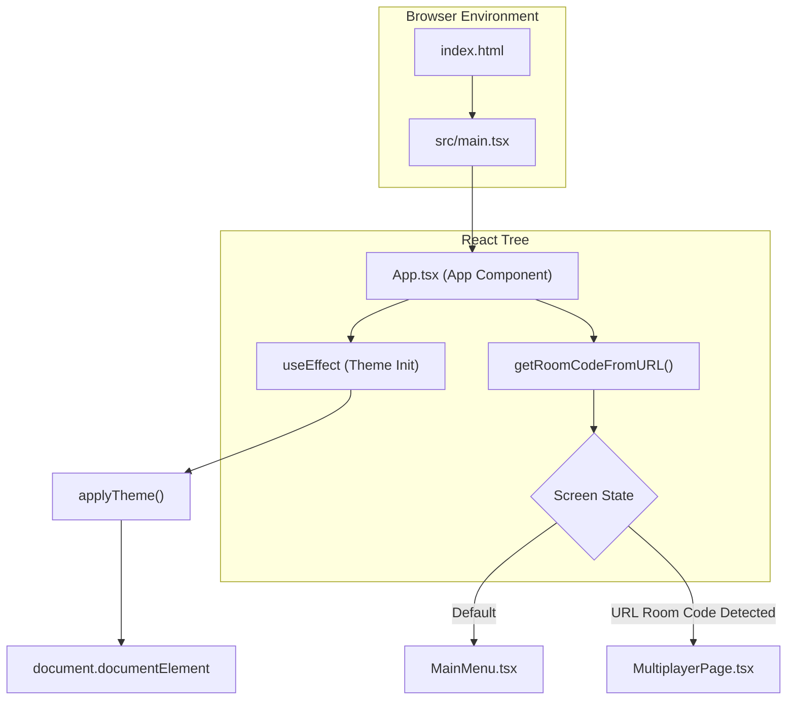
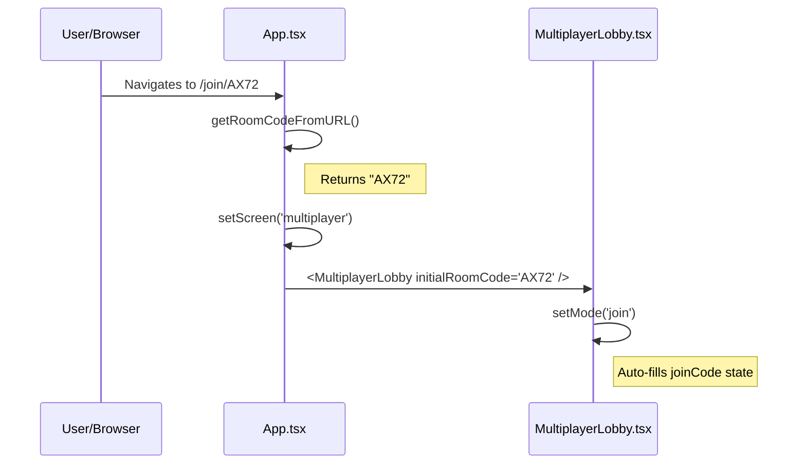

# Application Entry Point & Navigation

Relevant source files

The following files were used as context for generating this wiki page:

- [index.html](https://github.com/kllyjsn/battleship/blob/main/index.html)
- [public/og-image.png](https://github.com/kllyjsn/battleship/blob/main/public/og-image.png)
- [src/App.tsx](https://github.com/kllyjsn/battleship/blob/main/src/App.tsx)
- [src/components/MultiplayerLobby.tsx](https://github.com/kllyjsn/battleship/blob/main/src/components/MultiplayerLobby.tsx)
- [src/main.tsx](https://github.com/kllyjsn/battleship/blob/main/src/main.tsx)

This page details how the Battleship web application initializes, manages its top-level state, and handles navigation between different game modes. The application is a Single Page Application (SPA) that uses a state-driven approach for screen transitions rather than a traditional router library.

## Application Bootstrapping

The entry point of the application is `src/main.tsx`, which renders the `App` component into the HTML root element defined in `index.html`.

1.  **HTML Root**: `index.html` provides the `

` container and sets up initial meta tags for social media (Open Graph) and mobile responsiveness `index.html:1-31`.
2.  **React Initialization**: `src/main.tsx` uses `createRoot` to mount the React tree and includes the global CSS styles `src/main.tsx:1-11`.
3.  **App Component**: `App.tsx` serves as the primary orchestrator, managing the current screen state and global configurations like themes `src/App.tsx:19-72`.

### Visual Initialization Flow

The following diagram illustrates the transition from the static HTML file to the fully initialized React application.

**System Initialization Diagram**

Sources: `index.html:28-29`, `src/main.tsx:6-10`, `src/App.tsx:20-29`

## Navigation & Screen State Management

The application manages navigation through a `Screen` type definition in `App.tsx`. This state determines which high-level component is currently active in the view.

### Screen State Machine
The `screen` state can be one of three values: `'menu'`, `'single'`, or `'multiplayer'` `src/App.tsx:8-9`.

| Screen State | Component Rendered | Purpose |
| :--- | :--- | :--- |
| `menu` | `MainMenu` | Entry hub for mode selection, stats, and settings. |
| `single` | `SinglePlayer` | Solo game against the AI with selected difficulty. |
| `multiplayer` | `MultiplayerPage` | Networked game lobby or active session. |

### Navigation Handlers
*   **handleStartSinglePlayer**: Transitions to the AI mode. It accepts a `Difficulty` parameter (`'easy' | 'medium' | 'hard'`) which is passed down to the `SinglePlayer` component `src/App.tsx:31-34`.
*   **handleStartMultiplayer**: Transitions to the multiplayer lobby `src/App.tsx:36-38`.
*   **handleBack**: Resets the state to `'menu'`. Crucially, it also cleans up the browser URL using `window.history.replaceState` to remove room codes or join paths when returning to the main menu `src/App.tsx:40-47`.

Sources: `src/App.tsx:8-9`, `src/App.tsx:31-47`, `src/App.tsx:50-64`

## Deep-Linking & Room Codes

The application supports direct entry into multiplayer rooms via URLs. This is handled during the initial render of the `App` component.

### URL Parsing Logic
The function `getRoomCodeFromURL()` checks for room codes in two formats:
1.  **Path-based**: `/join/CODE` (e.g., `shipbattle.dev/join/ABCD`) `src/App.tsx:12-13`.
2.  **Query-based**: `?room=CODE` `src/App.tsx:15-16`.

If a code is found, the `App` component initializes its `screen` state to `'multiplayer'` and stores the `joinRoomCode` to be passed into the `MultiplayerPage` `src/App.tsx:20-23`.

### Deep-Linking Data Flow
**Deep-Link Resolution**

Sources: `src/App.tsx:10-17`, `src/App.tsx:20-23`, `src/components/MultiplayerLobby.tsx:34-35`

## Theme Initialization

On mount, the `App` component performs a side-effect to ensure the user's preferred visual aesthetic is applied immediately.

1.  **loadTheme()**: Retrieves the saved theme ID from `localStorage` (defaulting to 'classic' if none exists) `src/App.tsx:27`.
2.  **applyTheme(themeId)**: Injects the corresponding CSS variables into the `document.documentElement`. This ensures that all components using CSS variables for colors (e.g., `var(--hull-dark)`) render with the correct theme `src/App.tsx:28`, `src/components/MultiplayerLobby.tsx:83`.
3.  **CRT Overlay**: A global `div` with the class `crt-overlay` is rendered at the top level of the `App` component to provide the signature scanline effect across all screens `src/App.tsx:69`.

Sources: `src/App.tsx:25-29`, `src/App.tsx:69`, `src/lib/themes.ts` (referenced by import)

---