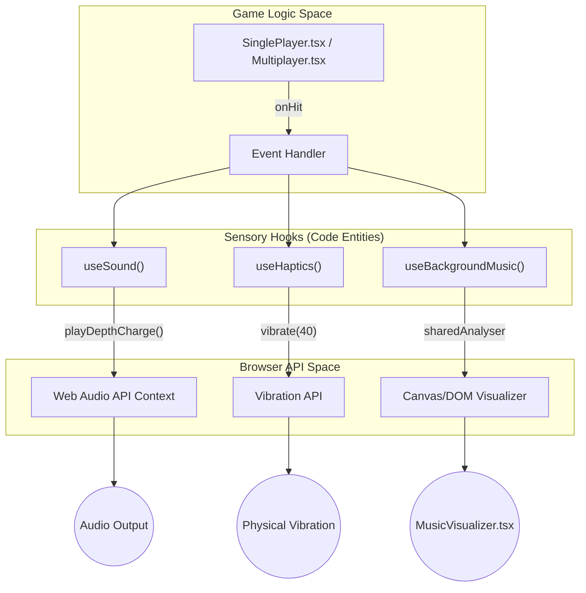
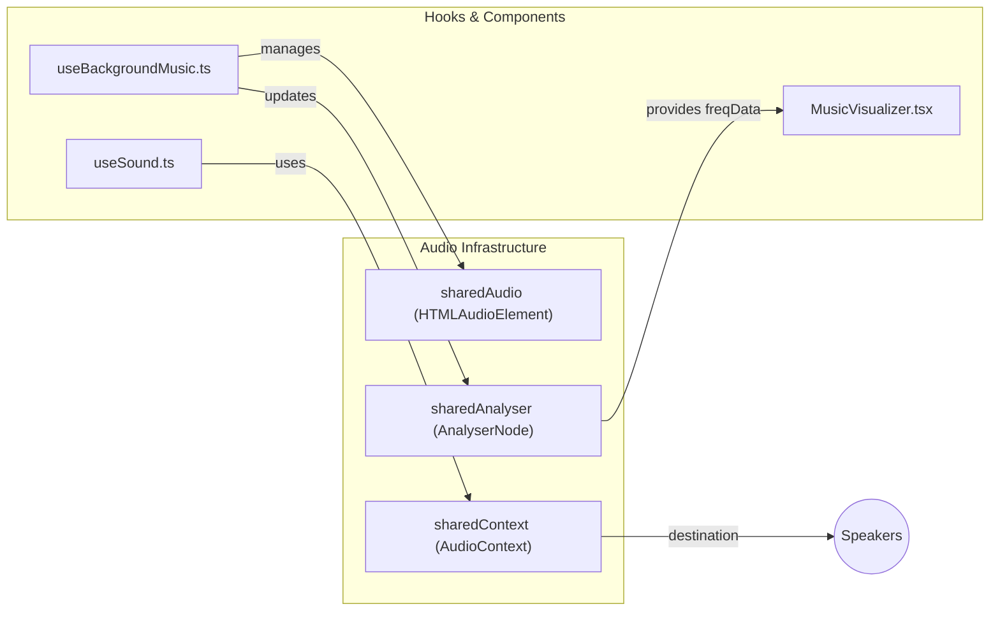

# Audio & Sensory Feedback

Relevant source files

The following files were used as context for generating this wiki page:

- [public/tiki-music.mp3](https://github.com/kllyjsn/battleship/blob/main/public/tiki-music.mp3)
- [src/components/BoardToggle.tsx](https://github.com/kllyjsn/battleship/blob/main/src/components/BoardToggle.tsx)
- [src/components/MusicVisualizer.tsx](https://github.com/kllyjsn/battleship/blob/main/src/components/MusicVisualizer.tsx)
- [src/hooks/useBackgroundMusic.ts](https://github.com/kllyjsn/battleship/blob/main/src/hooks/useBackgroundMusic.ts)
- [src/hooks/useHaptics.ts](https://github.com/kllyjsn/battleship/blob/main/src/hooks/useHaptics.ts)
- [src/hooks/useSound.ts](https://github.com/kllyjsn/battleship/blob/main/src/hooks/useSound.ts)

The Battleship application employs a multi-layered sensory feedback system to enhance player immersion. This system consists of procedurally synthesized sound effects, a persistent background music layer with real-time frequency analysis, and tactile haptic feedback for mobile devices.

## High-Level Architecture

The sensory system is decoupled from the game engine, reacting to state changes through dedicated React hooks.

### Audio Pipeline
The application utilizes both the **Web Audio API** for dynamic sound synthesis and standard **HTML5 Audio** for music streaming. 

*   **Procedural SFX**: Managed by `useSound.ts`, generating audio on-the-fly to avoid large asset downloads and allow for variable synthesis.
*   **Background Music**: Managed by `useBackgroundMusic.ts`, utilizing a singleton `AudioContext` and `AnalyserNode` to provide data for visual components.

### Haptic Feedback
Tactile responses are handled via the **Vibration API**, providing physical confirmation for hits, misses, and game outcomes.

| Interaction | Haptic Pattern | Code Entity |
| :--- | :--- | :--- |
| Cell Click / Miss | 15ms pulse | `tap()` |
| Ship Hit | 40ms pulse | `hit()` |
| Ship Sunk | [60ms, 50ms, 80ms] | `sunk()` |
| Victory | Long rhythmic rumble | `win()` |
| Defeat | Single heavy thud | `lose()` |

Sources: `src/hooks/useHaptics.ts:16-31`, `src/hooks/useSound.ts:1-5`

---

## Sound Effects (useSound)
The `useSound` hook provides a registry of game sounds synthesized using `OscillatorNode` and `BiquadFilterNode` primitives. It handles the `AudioContext` lifecycle, ensuring audio resumes only after user interaction to comply with browser autoplay policies.

**Key Features:**
*   **Synthesis Primitives**: Functions like `playTone`, `playFilteredNoise`, and `playDepthCharge` create complex maritime sounds (e.g., sonar pings, torpedo launches) without external files.
*   **Event Registry**: A `SOUNDS` object maps `SoundType` keys to specific synthesis sequences.

For details on procedural synthesis and the sound registry, see **[Sound Effects (useSound)](#7.1)**.

Sources: `src/hooks/useSound.ts:3-127`, `src/hooks/useSound.ts:222-230`

---

## Background Music & Visualizer
Background music is implemented as a shared singleton to maintain continuity across component re-renders. The system includes a real-time frequency analyzer that extracts spectral data for UI visualization.

**Key Components:**
*   **`useBackgroundMusic`**: Manages the `HTMLAudioElement` and `AnalyserNode` pipeline. It provides `freqData` (a normalized array of frequency magnitudes) to the UI.
*   **`MusicVisualizer`**: A functional component that renders a dynamic 5-8 bar chart based on the frequency data provided by the hook.

For details on the audio pipeline and visualizer rendering, see **[Background Music & Visualizer](#7.2)**.

Sources: `src/hooks/useBackgroundMusic.ts:5-42`, `src/components/MusicVisualizer.tsx:9-45`

---

## System Integration

The following diagrams illustrate how the sensory hooks bridge natural language game events to specific code entities and browser APIs.

### Sensory Feedback Flow
This diagram shows how a game event (like a "Hit") triggers multiple sensory outputs.

Sources: `src/hooks/useHaptics.ts:21-21`, `src/hooks/useSound.ts:158-184`, `src/hooks/useBackgroundMusic.ts:75-95`

### Audio Entity Relationship
This diagram maps the internal audio management entities to their respective roles.

Sources: `src/hooks/useBackgroundMusic.ts:5-10`, `src/hooks/useSound.ts:5-5`, `src/components/MusicVisualizer.tsx:9-10`

---