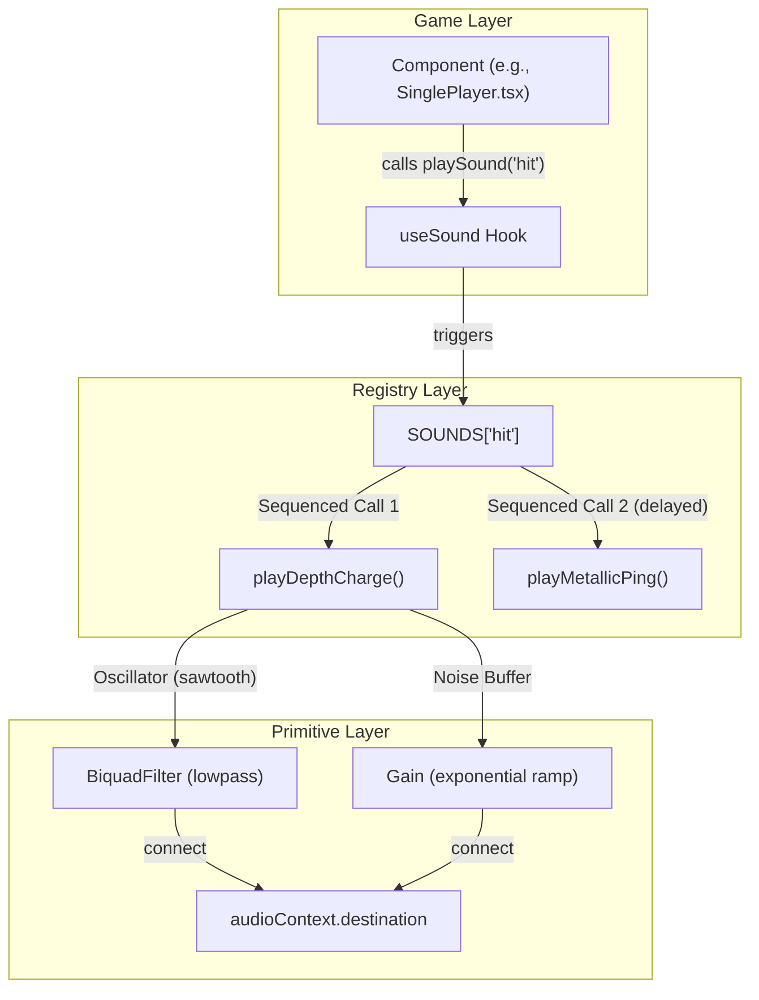
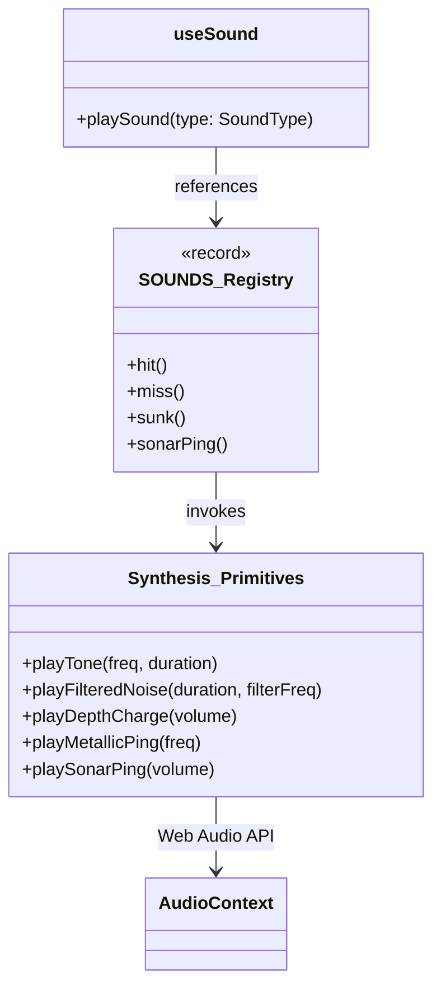

# Sound Effects (useSound)

Relevant source files

The following files were used as context for generating this wiki page:

- [src/hooks/useSound.ts](https://github.com/kllyjsn/battleship/blob/main/src/hooks/useSound.ts)

The audio system in Battleship is built on a procedural synthesis engine rather than static asset playback. By utilizing the **Web Audio API**, the application generates immersive, nautical-themed sound effects (SFX) in real-time. This approach ensures low latency, zero asset loading time, and the ability to dynamically modulate sounds based on game state.

## Core Architecture

The audio system is centralized in the `useSound` hook. It manages the `AudioContext` lifecycle and provides a registry of high-level sound events composed of low-level synthesis primitives.

### AudioContext Lifecycle
To comply with browser autoplay policies, the `AudioContext` is initialized lazily and resumed upon user interaction.

*   **Lazy Initialization**: The `audioContext` is created as a singleton outside the hook scope `src/hooks/useSound.ts:5-5`.
*   **Interaction Resume**: Every synthesis primitive checks the `audioContext.state`. If it is `'suspended'`, it calls `audioContext.resume()` `src/hooks/useSound.ts:16-16`.
*   **Cleanup**: An `useEffect` within the hook manages an ambient ocean loop (brown noise), ensuring it stops when the component unmounts `src/hooks/useSound.ts:285-300`.

### Data Flow: From Event to Waveform

The following diagram illustrates how a high-level game event (like a "hit") is processed through the synthesis pipeline.

**Sound Synthesis Pipeline**

**Sources:** `src/hooks/useSound.ts:222-280`, `src/hooks/useSound.ts:158-184`, `src/hooks/useSound.ts:130-155`

---

## Synthesis Primitives

The system uses several "primitive" functions to generate basic audio building blocks. These primitives use `GainNode` ramping to prevent "clicks" or "pops" by ensuring volume transitions are smooth (exponential).

| Function | Synthesis Method | Nautical Use Case |
| :--- | :--- | :--- |
| `playTone` | Sine/Square/Sawtooth oscillator with optional fade-in. | UI clicks and feedback tones. |
| `playFilteredNoise` | White noise buffer passed through a `BiquadFilter`. | Water splashes, engine hum, and bubbles. |
| `playDepthCharge` | Sawtooth oscillator ramping 80Hz → 30Hz + lowpass noise. | Ship hit explosions. |
| `playMetallicPing` | Two inharmonic sine oscillators (freq * 2.756). | Hull impact and structural stress sounds. |
| `playTorpedoLaunch` | Sawtooth oscillator with frequency sweep 200Hz → 800Hz → 100Hz. | Projectile firing. |
| `playSonarPing` | Sine oscillator (1520Hz) with a 200ms delayed "echo" return. | Radar/Sonar activation. |

**Sources:** `src/hooks/useSound.ts:8-39`, `src/hooks/useSound.ts:42-72`, `src/hooks/useSound.ts:75-127`, `src/hooks/useSound.ts:130-155`, `src/hooks/useSound.ts:158-184`, `src/hooks/useSound.ts:187-214`

---

## Sound Registry (`SOUNDS`)

The `SOUNDS` object maps the `SoundType` union to specific sequences of primitives. This allows for complex, multi-layered effects.

| SoundType | Composition Logic |
| :--- | :--- |
| `hit` | Triggers `playDepthCharge`, then `playMetallicPing` after 200ms `src/hooks/useSound.ts:227-230`. |
| `miss` | Triggers `playFilteredNoise` (splash) and `playHydrophoneStatic` `src/hooks/useSound.ts:232-235`. |
| `sunk` | A sequence of three `playDepthCharge` calls at 0ms, 300ms, and 600ms `src/hooks/useSound.ts:237-241`. |
| `sonarPing` | Standard 1.5s sonar sweep with echo `src/hooks/useSound.ts:223-225`. |
| `win` | A rising sequence of three sine tones (440Hz, 554Hz, 659Hz) `src/hooks/useSound.ts:255-261`. |

**Sources:** `src/hooks/useSound.ts:3-3`, `src/hooks/useSound.ts:222-280`

---

## Ambient Ocean Loop

The hook implements an ambient "ocean" background using **Brown Noise**. Unlike white noise, brown noise has higher energy at lower frequencies, creating a deep, rumbling underwater atmosphere.

*   **Implementation**: A 2-second buffer of random data is generated.
*   **Filtering**: A `lowpass` filter at 400Hz removes high-frequency hiss `src/hooks/useSound.ts:291-292`.
*   **Looping**: The `AudioBufferSourceNode` has its `loop` property set to `true` `src/hooks/useSound.ts:293-293`.
*   **Volume**: Set to a subtle 2% (`0.02`) to avoid interfering with game SFX `src/hooks/useSound.ts:295-295`.

**Sources:** `src/hooks/useSound.ts:285-300`

---

## Implementation Details

### Gain Ramping
To avoid audio artifacts, the system never sets gain abruptly. It uses `exponentialRampToValueAtTime` to transition to a near-zero value (`0.001`) over the duration of the sound `src/hooks/useSound.ts:33-33`, `src/hooks/useSound.ts:67-67`.

### Code Entity Mapping

This diagram maps the internal synthesis functions to the high-level API used by the React components.

**Entity Relationship**

**Sources:** `src/hooks/useSound.ts:3-5`, `src/hooks/useSound.ts:8-214`, `src/hooks/useSound.ts:222-280`, `src/hooks/useSound.ts:302-308`

---