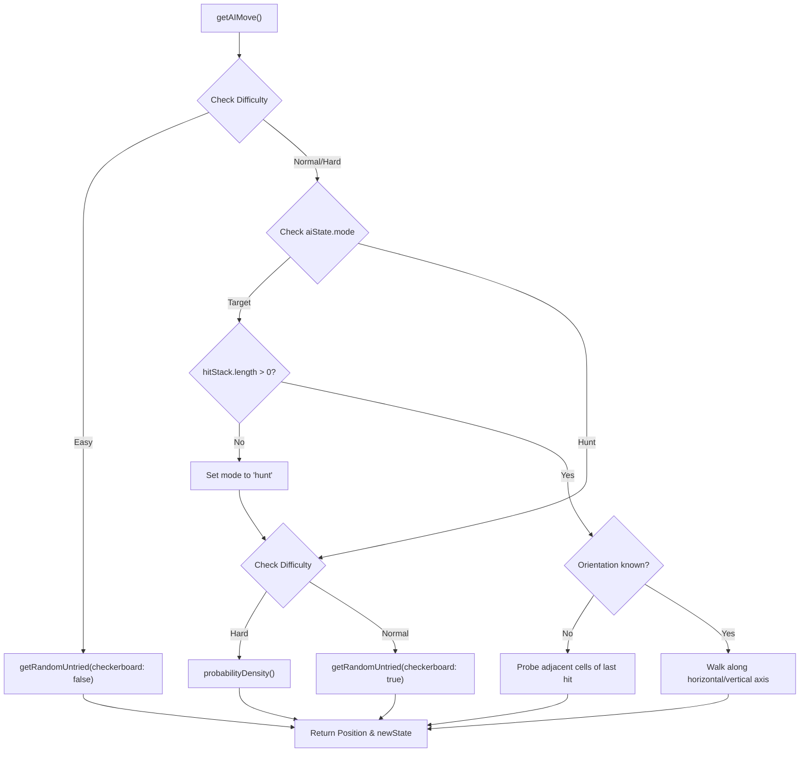
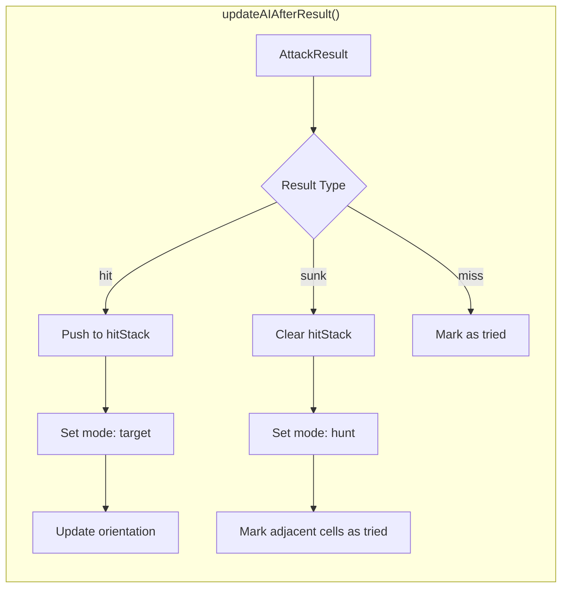
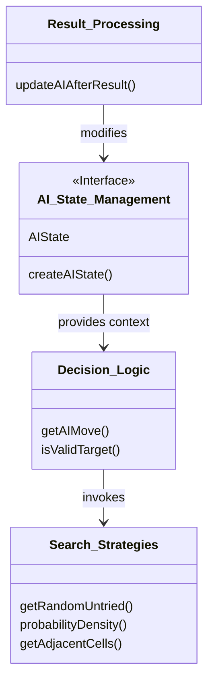

# AI Engine

Relevant source files

The following files were used as context for generating this wiki page:

- [src/components/ShipRoster.tsx](https://github.com/kllyjsn/battleship/blob/main/src/components/ShipRoster.tsx)
- [src/engine/ai.ts](https://github.com/kllyjsn/battleship/blob/main/src/engine/ai.ts)

The AI Engine manages the decision-making process for the computer opponent in single-player mode. It transitions between different search strategies based on the current game state and the selected difficulty level.

### Core AI State

The AI's internal memory is encapsulated in the `AIState` interface. Unlike the player, the AI maintains a "hit stack" and orientation knowledge to efficiently sink ships once discovered.

| Property | Type | Description |
| :--- | :--- | :--- |
| `mode` | `'hunt' \| 'target'` | Determines if the AI is searching for a new ship or finishing a known one. |
| `hitStack` | `Position[]` | A stack of coordinates that have been hit but belong to a ship not yet sunk. |
| `triedPositions` | `Set<string>` | A set of `row,col` strings representing every move already made. |
| `orientation` | `'unknown' \| 'horizontal' \| 'vertical'` | The inferred direction of the current target ship. |

**Sources:** `src/engine/ai.ts:4-11`, `src/engine/ai.ts:17-26`

---

### Decision Tree: Hunt vs. Target Modes

The AI logic primarily operates through a state machine that switches between **Hunt Mode** (searching for ships) and **Target Mode** (focusing on a specific ship after a hit).

#### 1. Hunt Mode
In Hunt Mode, the AI selects coordinates based on difficulty-specific algorithms:
*   **Easy:** Selects a random untried cell using `getRandomUntried` with the `checkerboard` flag set to `false` `src/engine/ai.ts:163-164`.
*   **Normal:** Uses a checkerboard pattern (only attacking cells where `(row + col) % 2 === 0`) to maximize coverage with fewer shots `src/engine/ai.ts:48-58`.
*   **Admiral (Hard):** Employs **Probability Density Mapping** to calculate the most likely locations of remaining enemy ships `src/engine/ai.ts:223-225`.

#### 2. Target Mode
Triggered after a successful hit, Target Mode attempts to identify the ship's orientation and sink it:
*   **Unknown Orientation:** The AI probes adjacent cells (Up, Down, Left, Right) `src/engine/ai.ts:170-176`.
*   **Known Orientation:** Once two hits are aligned, the AI "walks" along the line (horizontal or vertical) until it misses or sinks the ship `src/engine/ai.ts:182-205`.

#### AI Decision Flow
The following diagram illustrates the `getAIMove` logic flow:

**AI Decision Logic**

**Sources:** `src/engine/ai.ts:149-231`

---

### Probability Density Mapping (Admiral Difficulty)

For the "Hard" difficulty, the AI simulates all possible placements for every remaining ship on the board.

1.  **Ship Iteration:** The AI retrieves the list of `opponentShips` that are not yet `sunk` `src/engine/ai.ts:79-82`.
2.  **Placement Simulation:** For every ship size, it scans every valid horizontal and vertical position on the board `src/engine/ai.ts:84-125`.
3.  **Validity Check:** A position is valid only if none of the cells are marked as `miss` or `sunk` `src/engine/ai.ts:91-94`.
4.  **Density Increment:** For every valid placement, the "density score" of those cells is incremented in a 10x10 matrix `src/engine/ai.ts:99-121`.
5.  **Selection:** The AI picks the cell with the highest density score. If multiple cells tie, it chooses one randomly `src/engine/ai.ts:135-146`.

**Sources:** `src/engine/ai.ts:75-147`

---

### State Updates and Hit-Stack Management

After an attack result is returned, the `updateAIAfterResult` function synchronizes the AI's internal state with the outcome.

#### Handling a "Hit"
*   The position is added to `newState.hitStack` `src/engine/ai.ts:245`.
*   `newState.mode` is set to `'target'` `src/engine/ai.ts:246`.
*   If this is the second hit on a ship, the AI calculates the `orientation` (horizontal if rows match, vertical if columns match) `src/engine/ai.ts:251-255`.

#### Handling a "Sunk" Result
*   The AI clears the `hitStack` and resets `orientation` to `'unknown'` `src/engine/ai.ts:265-267`.
*   `newState.mode` returns to `'hunt'` `src/engine/ai.ts:268`.
*   The AI also identifies the cells adjacent to the sunk ship and marks them as `triedPositions` (since ships cannot touch in standard rules) `src/engine/ai.ts:271-282`.

**State Synchronization Flow**

**Sources:** `src/engine/ai.ts:233-288`

---

### Code Entity Mapping

The following diagram maps the logical concepts of the AI Engine to the specific functions and interfaces within `src/engine/ai.ts`.

**System Architecture Mapping**

**Sources:** `src/engine/ai.ts:4-26`, `src/engine/ai.ts:149-154`, `src/engine/ai.ts:233-238`

---