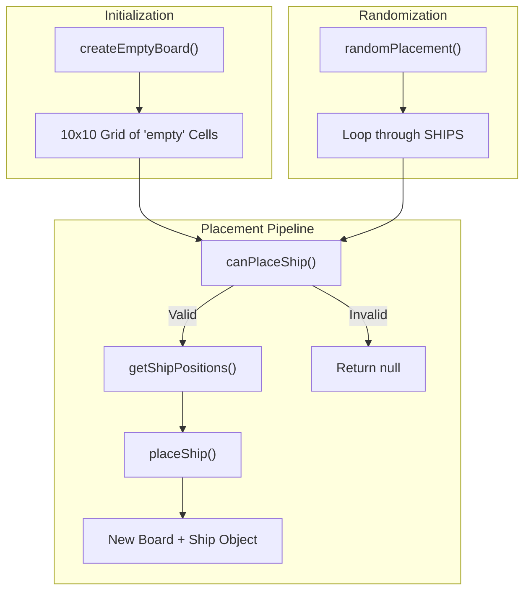
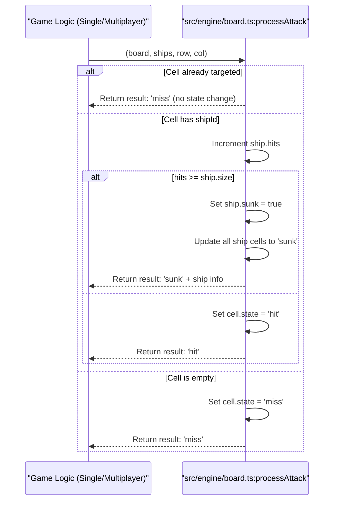

# Board Engine

Relevant source files

The following files were used as context for generating this wiki page:

- [src/engine/board.ts](https://github.com/kllyjsn/battleship/blob/main/src/engine/board.ts)
- [src/engine/constants.ts](https://github.com/kllyjsn/battleship/blob/main/src/engine/constants.ts)

The Board Engine, implemented in `src/engine/board.ts`, serves as the core state-management layer for the Battleship grid. It provides pure functions for board initialization, ship placement validation, attack resolution, and visibility masking.

## Board Initialization and Structure

The game board is represented as a 2D array of `Cell` objects. The dimensions are governed by the `BOARD_SIZE` constant (default 10x10) `src/engine/constants.ts:3`.

*   **`createEmptyBoard()`**: Iterates through rows and columns to generate a nested array. Every cell is initialized with a state of `'empty'` and a `shipId` of `null` `src/engine/board.ts:4-14`.
*   **Cell State**: Each cell tracks its own coordinates, visual state (empty, ship, hit, miss, sunk), and an optional reference to a ship ID `src/engine/board.ts:9`.

### Board Data Flow

The following diagram illustrates how the Board Engine transitions from an empty state to a populated game state.

**Board Population Logic**

Sources: `src/engine/board.ts:4-14`, `src/engine/board.ts:16-31`, `src/engine/board.ts:49-80`, `src/engine/board.ts:154-180`

## Ship Placement Mechanics

The engine ensures that ships are placed within bounds and do not overlap.

| Function | Responsibility | Implementation Detail |
| :--- | :--- | :--- |
| `canPlaceShip` | Validation | Checks if calculated coordinates are within `BOARD_SIZE` and if `cell.shipId` is currently `null` `src/engine/board.ts:23-30`. |
| `getShipPositions` | Coordinate Mapping | Generates an array of `{row, col}` based on `Orientation` ('horizontal' or 'vertical') `src/engine/board.ts:33-47`. |
| `placeShip` | State Update | Performs an immutable update of the board, setting cell states to `'ship'` and assigning the `shipId` `src/engine/board.ts:59-67`. |
| `removeShipFromBoard` | Cleanup | Scans the board and reverts any cell matching the `shipId` back to `'empty'` `src/engine/board.ts:82-88`. |

### Random Placement Algorithm
The `randomPlacement` function automates board setup by attempting to place each `ShipDefinition` from the `SHIPS` constant. It uses a `while` loop with a maximum of 1000 attempts per ship to find a valid configuration, randomly toggling between horizontal and vertical orientations `src/engine/board.ts:154-180`.

Sources: `src/engine/board.ts:16-88`, `src/engine/board.ts:154-180`, `src/engine/constants.ts:5-11`

## Attack Resolution Pipeline

The `processAttack` function is the primary entry point for gameplay interactions. It handles the logic for hits, misses, and ship destruction.

**Attack Processing Sequence**

Sources: `src/engine/board.ts:90-148`

### Key Logic Steps:
1.  **Idempotency Check**: If a cell is already in a `'hit'`, `'miss'`, or `'sunk'` state, the function returns a `'miss'` to prevent double-counting `src/engine/board.ts:100-106`.
2.  **Hit Registration**: If a `shipId` exists, the corresponding ship in the `ships` array is updated. The engine uses immutable patterns, mapping over the existing array to create `newShips` `src/engine/board.ts:97-110`.
3.  **Sunk Resolution**: When a ship's hit count reaches its size, the engine iterates through all coordinates belonging to that ship (`ship.positions`) and updates the board cells to the `'sunk'` state `src/engine/board.ts:114-120`.
4.  **Victory Condition**: `allShipsSunk(ships)` provides a utility to check if every ship in the provided array has its `sunk` property set to `true` `src/engine/board.ts:150-152`.

## Visibility and Fog of War

In Battleship, players should not see the opponent's ship locations until they are hit or the game ends.

*   **`getVisibleBoard(board, hideShips)`**: This utility masks the board state for the UI. If `hideShips` is true, any cell with a state of `'ship'` is transformed into `'empty'` and its `shipId` is stripped for the returned view `src/engine/board.ts:182-191`.
*   **Data Integrity**: This transformation is non-destructive; it creates a shallow copy of the cells to ensure the underlying game state remains intact while providing a filtered version for the opponent's view `src/engine/board.ts:184-190`.

Sources: `src/engine/board.ts:182-191`

---