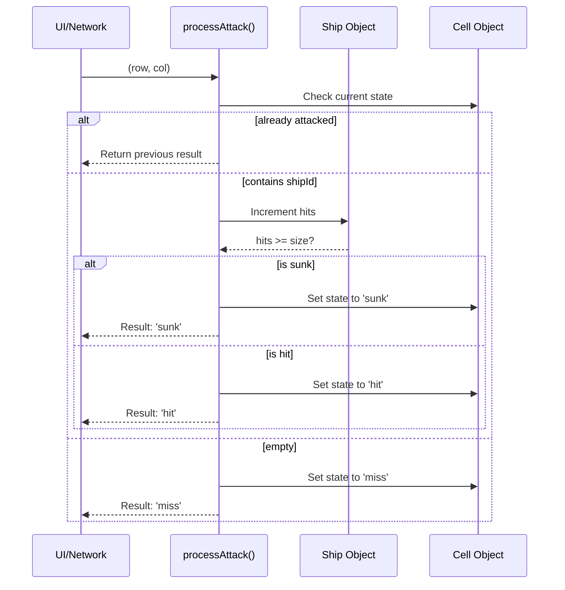

# Game Engine

<details>
<summary>Relevant source files</summary>

The following files were used as context for generating this wiki page:

- [src/components/BattleLog.tsx](https://github.com/kllyjsn/battleship/blob/main/src/components/BattleLog.tsx)
- [src/engine/board.ts](https://github.com/kllyjsn/battleship/blob/main/src/engine/board.ts)
- [src/engine/constants.ts](https://github.com/kllyjsn/battleship/blob/main/src/engine/constants.ts)
- [src/engine/types.ts](https://github.com/kllyjsn/battleship/blob/main/src/engine/types.ts)
- [src/multiplayer/pubnub.ts](https://github.com/kllyjsn/battleship/blob/main/src/multiplayer/pubnub.ts)

</details>


The **Game Engine** is the core logic layer of the Battleship application. It is responsible for maintaining the integrity of the 10x10 grid, validating ship placements, processing combat interactions, and driving the AI decision-making process. This layer is entirely decoupled from the React UI, allowing the same logic to be shared between Single Player and Multiplayer modes.

### Engine Architecture

The engine is structured into three primary subsystems:
1.  **Data Model**: Defines the shapes of boards, ships, and game states.
2.  **Board Mechanics**: Pure functions for grid manipulation and attack resolution.
3.  **AI Logic**: State machines and probability algorithms for the computer opponent.

#### Code Entity Mapping
The following diagram bridges the high-level system concepts to the specific code entities defined in the engine.

**System to Code Entity Map**
```mermaid
graph TD
    subgraph "Data Model"
        "BoardState"["Board"] --- "CellInterface"["Cell"]
        "ShipState"["Ship"] --- "Pos"["Position"]
    end

    subgraph "Board Engine"
        "processAttack"["processAttack()"]
        "placeShip"["placeShip()"]
        "randomPlacement"["randomPlacement()"]
    end

    subgraph "AI Subsystem"
        "getAIMove"["getAIMove()"]
        "HuntMode"["'hunt'"]
        "TargetMode"["'target'"]
    end

    "BoardState" --> "processAttack"
    "ShipState" --> "processAttack"
    "getAIMove" --> "HuntMode"
    "getAIMove" --> "TargetMode"
```
**Sources:** `src/engine/types.ts:1-61`, `src/engine/board.ts:49-148`

---

## [Types & Data Model](#2.1)

The engine relies on a strictly typed schema to ensure consistency across the network and local state. The `Board` is represented as a 2D array of `Cell` objects `src/engine/types.ts:41`, while `Ship` objects track the health and orientation of individual vessels `src/engine/types.ts:18-26`.

Key enums like `GamePhase` ('placement', 'battle', 'gameover') `src/engine/types.ts:7` and `CellState` ('empty', 'ship', 'hit', 'miss', 'sunk') `src/engine/types.ts:1` drive the conditional rendering in the UI.

For a full reference of interfaces, see **[Types & Data Model](#2.1)**.

**Sources:** `src/engine/types.ts:1-110`

---

## [Board Engine](#2.2)

The Board Engine contains the "physics" of the game. It manages the `BOARD_SIZE` (default 10) `src/engine/constants.ts:3` and the standard fleet of 5 ships `src/engine/constants.ts:5-11`. 

### Core Logic Pipeline
When an attack is initiated, `processAttack` handles the transition of cell states and determines if a ship has been sunk by comparing `ship.hits` to `ship.size` `src/engine/board.ts:110-112`.

**Attack Resolution Flow**


For details on grid validation and placement algorithms, see **[Board Engine](#2.2)**.

**Sources:** `src/engine/board.ts:90-148`, `src/engine/constants.ts:3-11`

---

## [AI Engine](#2.3)

The AI Engine simulates a human opponent through a stateful decision tree. It operates in two primary modes:
*   **Hunt Mode**: The AI searches the board using a checkerboard pattern or probability density.
*   **Target Mode**: Once a "hit" is registered, the AI focuses on adjacent cells (North, South, East, West) to sink the identified ship.

The AI utilizes a `hitStack` to manage multiple active targets and an `aiState` to persist memory between turns. On 'Admiral' difficulty, the engine calculates the probability of ship placement for every cell before firing.

For details on the AI's decision-making and difficulty scaling, see **[AI Engine](#2.3)**.

**Sources:** `src/engine/types.ts:5` (Difficulty types), `src/engine/board.ts:154-180` (Randomization logic used by AI)

---

## Global Constants

The engine is configured via a set of immutable constants that define the standard rules of engagement.

| Constant | Value | Description |
| :--- | :--- | :--- |
| `BOARD_SIZE` | `10` | The dimensions of the square grid `src/engine/constants.ts:3`. |
| `SHIPS` | `Array(5)` | The standard fleet: Carrier(5), Battleship(4), Cruiser(3), Submarine(3), Destroyer(2) `src/engine/constants.ts:5-11`. |
| `TOTAL_SHIP_CELLS` | `17` | Sum of all ship sizes, used for win condition calculation `src/engine/constants.ts:13`. |
| `ROW_LABELS` | `A-J` | Letter coordinates for the Y-axis `src/engine/constants.ts:15`. |

**Sources:** `src/engine/constants.ts:1-18`

---