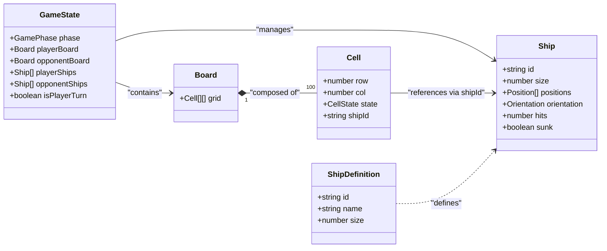
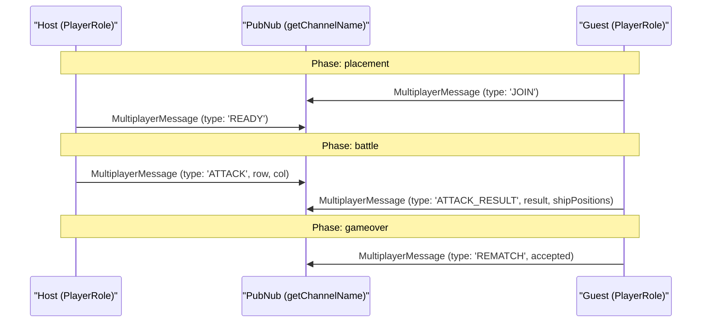

# Types & Data Model

Relevant source files

The following files were used as context for generating this wiki page:

- [src/components/BattleLog.tsx](https://github.com/kllyjsn/battleship/blob/main/src/components/BattleLog.tsx)
- [src/engine/constants.ts](https://github.com/kllyjsn/battleship/blob/main/src/engine/constants.ts)
- [src/engine/types.ts](https://github.com/kllyjsn/battleship/blob/main/src/engine/types.ts)
- [src/multiplayer/pubnub.ts](https://github.com/kllyjsn/battleship/blob/main/src/multiplayer/pubnub.ts)

This section provides a detailed reference for the core TypeScript interfaces and types that define the Battleship game engine and its data structures. The data model is designed to be highly serializable to facilitate both local state management and real-time multiplayer synchronization.

## Core Game Entities

The fundamental building blocks of the game consist of the board, its constituent cells, and the ships placed upon them.

### Board & Cell
The game board is represented as a 2D array of `Cell` objects. Each cell tracks its coordinate, its current state (e.g., whether it has been attacked), and a reference to any ship occupying that space.

| Interface/Type | Description |
| :--- | :--- |
| `Board` | A 2D array alias: `Cell[][]`. `src/engine/types.ts:41-41` |
| `Cell` | Represents a single tile on the grid. Contains `row`, `col`, `state`, and an optional `shipId`. `src/engine/types.ts:34-39` |
| `CellState` | Union type: `'empty' \| 'ship' \| 'hit' \| 'miss' \| 'sunk'`. `src/engine/types.ts:1-1` |
| `Position` | A simple coordinate object with `row: number` and `col: number`. `src/engine/types.ts:13-16` |

### Ship Structures
Ships are defined in two ways: as static templates (`ShipDefinition`) and as active game instances (`Ship`).

*   **ShipDefinition**: Static configuration used for game setup (e.g., the Carrier is size 5). `src/engine/types.ts:28-32`
*   **Ship**: An active instance that tracks its current `orientation`, the specific `positions` it occupies on a board, the number of `hits` received, and its `sunk` status. `src/engine/types.ts:18-26`

### Data Entity Relationship
The following diagram illustrates how these core entities relate to one another within the `GameState`.

**Diagram: Entity Relationship Map**

Sources: `src/engine/types.ts:1-61`, `src/engine/constants.ts:5-11`

---

## State & Lifecycle Types

The game progresses through distinct phases and modes, controlled by the following union types and interfaces.

### Game State & Phases
The `GameState` interface acts as the "Single Source of Truth" for a game session, whether in single-player or multiplayer mode. `src/engine/types.ts:51-61`

*   **GamePhase**: Manages the high-level lifecycle: `placement` (positioning ships), `battle` (active turns), and `gameover` (results). `src/engine/types.ts:7-7`
*   **GameMode**: Distinguishes between `single` and `multiplayer` logic. `src/engine/types.ts:9-9`
*   **PlayerRole**: In multiplayer, defines if the user is the `host` or the `guest`. `src/engine/types.ts:11-11`

### Attack Resolution
When a player targets a coordinate, the engine returns an `AttackResult`. This object is used to update the UI and synchronize state across the network.

| Property | Type | Description |
| :--- | :--- | :--- |
| `position` | `Position` | The targeted coordinates. |
| `result` | `'hit' \| 'miss' \| 'sunk'` | The outcome of the attack. |
| `shipName` | `string` (Optional) | The name of the ship if it was sunk. |
| `shipPositions`| `Position[]` (Optional) | Used to reveal the full ship on the UI when sunk. |

Sources: `src/engine/types.ts:43-49`

---

## Networking & Communication

The multiplayer component relies on a robust message schema to ensure both clients remain in sync despite the asynchronous nature of PubNub.

### MultiplayerMessage
The `MultiplayerMessage` is a "fat" union type that covers every possible interaction over the network. It is handled by the `useMultiplayer` hook and the `pubnub.ts` utility. `src/engine/types.ts:63-86`

**Diagram: Multiplayer Message Flow**

Sources: `src/engine/types.ts:63-86`, `src/multiplayer/pubnub.ts:52-54`

---

## UI Support Types

Several types exist specifically to support UI components like the Battle Log and Chat system.

### Battle Log & Coordination
The `BattleLogEntry` interface tracks the history of moves for display in the `BattleLog.tsx` component. It uses the `coordLabel` utility to convert raw indices (0,0) into naval coordinates (A1).

*   **BattleLogEntry**: Includes `turn`, `player`, `position`, and `result`. `src/engine/types.ts:101-109`
*   **coordLabel**: A helper function that maps row indices to `ROW_LABELS` (A-J). `src/components/BattleLog.tsx:9-11`, `src/engine/constants.ts:15-15`

### Chat & Social
The communication system supports both text messages and emoji reactions.

*   **ChatMessage**: Contains the message string, sender ID, and an array of `ChatReaction` objects. `src/engine/types.ts:93-99`
*   **ChatReaction**: Tracks which `sender` applied a specific `emoji`. `src/engine/types.ts:88-91`

Sources: `src/engine/types.ts:88-109`, `src/components/BattleLog.tsx:9-11`

---