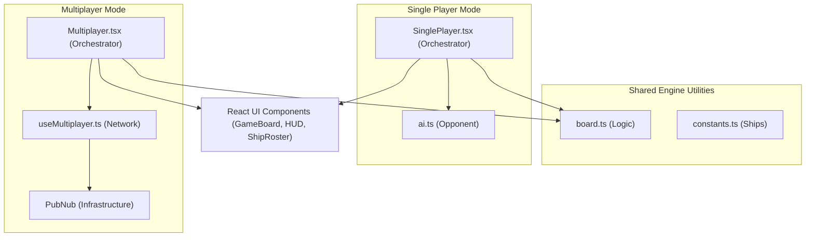
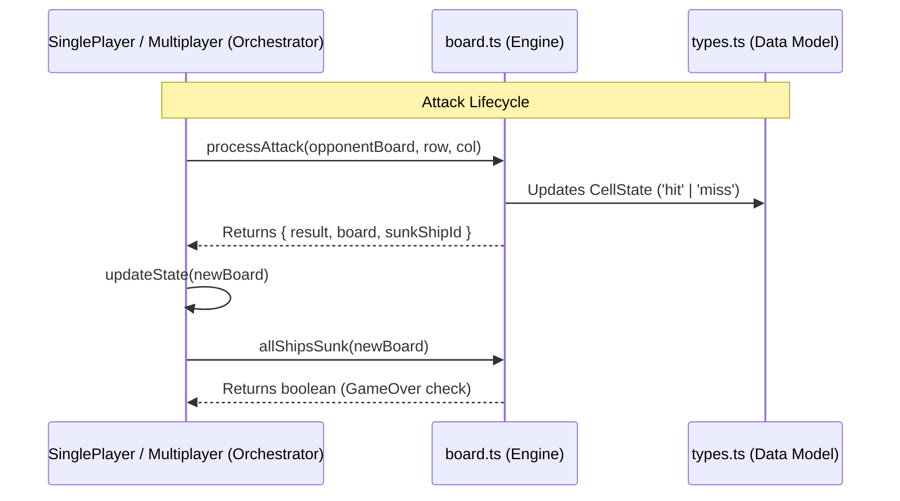

# Game Modes

Relevant source files

The following files were used as context for generating this wiki page:

- [src/pages/Multiplayer.tsx](https://github.com/kllyjsn/battleship/blob/main/src/pages/Multiplayer.tsx)
- [src/pages/SinglePlayer.tsx](https://github.com/kllyjsn/battleship/blob/main/src/pages/SinglePlayer.tsx)

The Battleship application provides two distinct gameplay experiences: **Single Player** and **Multiplayer**. While both modes utilize the same underlying [Game Engine](#2) for board validation and combat resolution, they differ significantly in how they orchestrate the game lifecycle, handle turn sequencing, and manage state synchronization.

## High-Level Orchestration

Both modes follow a standardized phase-based state machine defined by the `GamePhase` type: `placement` → `battle` → `gameover` `src/engine/types.ts:71-71`.

### Component Architecture
The application uses two primary "page" components to manage these modes. These components act as the central "brain" for their respective modes, maintaining the state of both boards, the battle log, and the current turn status.

| Feature | Single Player (`SinglePlayer.tsx`) | Multiplayer (`Multiplayer.tsx`) |
|:---|:---|:---|
| **Opponent** | Local AI Engine `src/engine/ai.ts` | Remote Human via PubNub `src/multiplayer/useMultiplayer.ts` |
| **Turn Logic** | Local state updates + `setTimeout` | Networked message exchange |
| **Placement** | Local validation | Local validation + `READY` signal |
| **Game Loop** | Synchronous functional calls | Asynchronous event-driven messages |

### Mode Comparison Diagram
The following diagram illustrates how the two modes share core engine utilities while diverging in their communication layers.

Sources: `src/pages/SinglePlayer.tsx:4-12`, `src/pages/Multiplayer.tsx:4-19`, `src/engine/types.ts:71-71`

---

## Single Player Mode

In Single Player mode, the user competes against an automated AI. The `SinglePlayer` component orchestrates the game by directly invoking the AI decision-making engine and managing a local "processing" mutex to prevent input during the AI's turn.

*   **AI Integration**: The mode initializes an AI state using `createAIState()` `src/pages/SinglePlayer.tsx:50-50` and requests moves via `getAIMove()` `src/engine/ai.ts:46-46`.
*   **Turn Sequencing**: AI moves are triggered after a short delay using `setTimeout` to simulate "thinking" and allow the player to process visual feedback `src/pages/SinglePlayer.tsx:244-250`.
*   **Input Abstraction**: Supports Mouse, Touch (via `useSwipe`), and Keyboard (Arrow keys + Enter) for both ship placement and targeting `src/pages/SinglePlayer.tsx:140-170`.

For implementation details on AI difficulty levels and turn sequencing, see **[Single Player Mode](#3.1)**.

Sources: `src/pages/SinglePlayer.tsx:33-72`, `src/engine/ai.ts:1-12`

---

## Multiplayer Mode

Multiplayer mode facilitates real-time matches between two human players over the internet. It introduces a `lobby` phase and relies on the `useMultiplayer` hook to synchronize actions across the network.

*   **Synchronization**: Uses a messaging protocol (e.g., `ATTACK`, `ATTACK_RESULT`) to ensure both clients reflect the same game state `src/pages/Multiplayer.tsx:167-180`.
*   **Security**: Ship positions are kept local; only the result of an attack (hit/miss) is transmitted, preventing "inspect element" cheating.
*   **Spectator Support**: Allows third parties to join a room and watch the match in real-time via `SPECTATOR_SYNC` messages `src/pages/Multiplayer.tsx:168-170`.
*   **Turn Management**: Includes a `TurnTimer` component that automatically triggers a random attack if the player fails to act within 30 seconds `src/pages/Multiplayer.tsx:120-142`.

For details on the networking protocol, rematch handshakes, and stale-closure prevention, see **[Multiplayer Mode](#3.2)**.

Sources: `src/pages/Multiplayer.tsx:117-163`, `src/multiplayer/useMultiplayer.ts:1-20`

---

## Data Flow: Engine vs. Orchestrator

The "Natural Language Space" of playing a game is mapped to the "Code Entity Space" through the interaction between the `Page` components and the `board.ts` functions.

Sources: `src/engine/board.ts:108-140`, `src/engine/types.ts:32-40`, `src/pages/SinglePlayer.tsx:195-215`

---