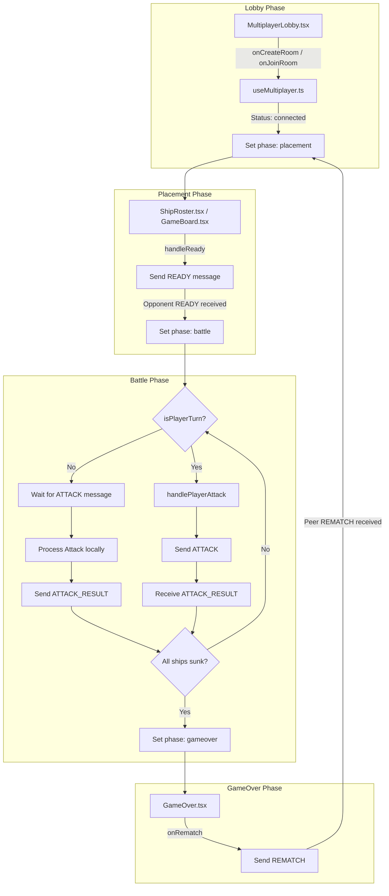
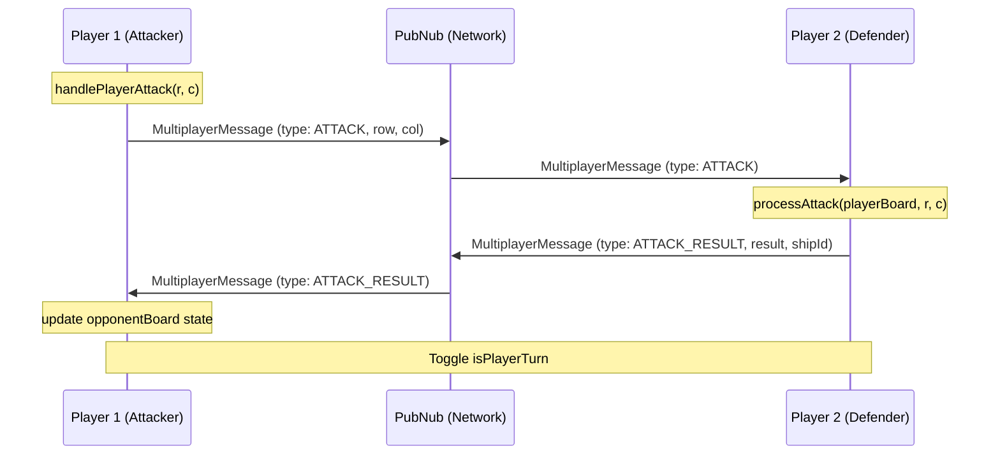

# Multiplayer Mode

Relevant source files

The following files were used as context for generating this wiki page:

- [src/App.tsx](https://github.com/kllyjsn/battleship/blob/main/src/App.tsx)
- [src/components/MultiplayerLobby.tsx](https://github.com/kllyjsn/battleship/blob/main/src/components/MultiplayerLobby.tsx)
- [src/components/TurnTimer.tsx](https://github.com/kllyjsn/battleship/blob/main/src/components/TurnTimer.tsx)
- [src/pages/Multiplayer.tsx](https://github.com/kllyjsn/battleship/blob/main/src/pages/Multiplayer.tsx)

The `MultiplayerPage` component acts as the primary orchestrator for networked gameplay, managing the transition between room setup, ship placement, and the real-time battle loop. It leverages the `useMultiplayer` hook to abstract PubNub communication and integrates with the core engine to validate moves and update game state.

## 1. Game Lifecycle and Phase Management

The multiplayer session progresses through a series of discrete phases managed by the `phase` state `src/pages/Multiplayer.tsx:40`.

| Phase | Description | Transition Trigger |
|:---|:---|:---|
| **Lobby** | Initial state where players create/join rooms via `MultiplayerLobby`. | `mp.status === 'connected'` and `mp.opponent` is present. |
| **Placement** | Players position ships on their local `playerBoard`. | Both players send a `READY` message. |
| **Battle** | Active combat loop where players exchange `ATTACK` and `ATTACK_RESULT` messages. | All ships of one player are sunk. |
| **GameOver** | Results display, achievement checking, and rematch handling. | `REMATCH` handshake or manual exit. |

### Lifecycle Flow Diagram

**Sources:** `src/pages/Multiplayer.tsx:40-51`, `src/pages/Multiplayer.tsx:167-280`, `src/components/MultiplayerLobby.tsx:5-16`

---

## 2. Attack Lifecycle (Send/Receive/Confirm)

The multiplayer battle loop uses a three-step confirmation process to ensure both clients remain synchronized without exposing ship positions prematurely.

1.  **Initiation**: The active player calls `handlePlayerAttack`, which sends an `ATTACK` message containing `{ row, col }` `src/pages/Multiplayer.tsx:355-373`.
2.  **Resolution**: The receiving player processes the attack against their local `playerBoard` using `processAttack` `src/pages/Multiplayer.tsx:185-204`.
3.  **Confirmation**: The receiver sends back an `ATTACK_RESULT` containing the outcome (`hit`, `miss`, or `sunk`) and, if a ship was sunk, the ship's ID and coordinates `src/pages/Multiplayer.tsx:201-203`.

### Network Interaction Diagram

**Sources:** `src/pages/Multiplayer.tsx:185-220`, `src/pages/Multiplayer.tsx:355-373`

---

## 3. Spectator Support and Synchronization

The system supports a spectator mode where a third party can watch the match. 

*   **SPECTATE Message**: When a spectator joins, they send a `SPECTATE` message `src/pages/Multiplayer.tsx:238-241`.
*   **SPECTATOR_SYNC**: The Host (the player who created the room) responds with a `SPECTATOR_SYNC` message containing the full state of both boards and player names `src/pages/Multiplayer.tsx:243-254`.
*   **State Updates**: Spectators listen for `ATTACK_RESULT` and `READY` messages to update their local `spectatorHostBoard` and `spectatorGuestBoard` in real-time `src/pages/Multiplayer.tsx:257-279`.

**Sources:** `src/pages/Multiplayer.tsx:79-84`, `src/pages/Multiplayer.tsx:238-279`

---

## 4. Automation and Safety Mechanisms

### TurnTimer & Auto-Attack
To prevent stalled games, the `TurnTimer` component `src/components/TurnTimer.tsx:10-32` triggers an auto-attack if the 30-second window expires. The `handleTurnTimeout` function selects a random valid cell from the `opponentBoard` and fires an attack automatically `src/pages/Multiplayer.tsx:144-163`.

### Stale-Closure Prevention
Because the multiplayer message handler is defined within a `useEffect` hook, it risks capturing stale state. The implementation uses several `useRef` hooks to provide the most current values during message processing:
*   `playerBoardRef`: Used to process incoming attacks against the latest board state `src/pages/Multiplayer.tsx:86-95`.
*   `isPlayerTurnRef`: Ensures turns are toggled correctly regardless of render cycles `src/pages/Multiplayer.tsx:89-107`.
*   `isProcessingRef`: A mutex to prevent multiple simultaneous attacks during network latency `src/pages/Multiplayer.tsx:76`.

### Rematch Handshake
Post-game, players can signal a desire for a rematch. The game only resets to the `placement` phase once both players have sent the `REMATCH` signal `src/pages/Multiplayer.tsx:222-236`.

**Sources:** `src/pages/Multiplayer.tsx:119-142`, `src/pages/Multiplayer.tsx:144-163`, `src/pages/Multiplayer.tsx:86-115`, `src/components/TurnTimer.tsx:1-80`

---

## 5. Post-Game Processing

Upon game completion (when `allShipsSunk` returns true), `MultiplayerPage` executes the following:
1.  **Replay Storage**: Finalizes the `replayData` object, including all moves recorded in `replayMovesRef` `src/pages/Multiplayer.tsx:432-446`.
2.  **Stats Persistence**: Calls `saveGameResult` to update local storage and the remote leaderboard `src/pages/Multiplayer.tsx:448-457`.
3.  **Achievements**: Runs `checkAchievements` to evaluate if the player met any multiplayer-specific criteria (e.g., high accuracy or specific win conditions) `src/pages/Multiplayer.tsx:459-467`.

**Sources:** `src/pages/Multiplayer.tsx:430-475`, `src/lib/gameResults.ts:1-20`, `src/lib/achievements.ts:1-15`

---