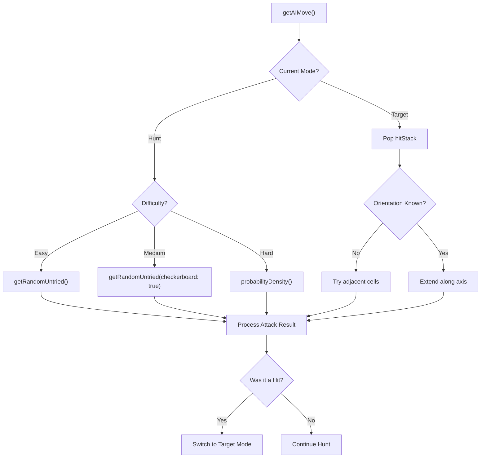
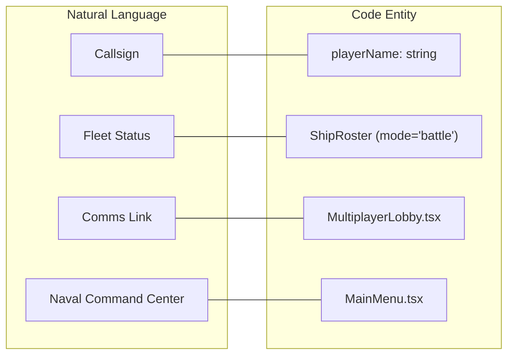

# Glossary

Relevant source files

The following files were used as context for generating this wiki page:

- [src/App.tsx](https://github.com/kllyjsn/battleship/blob/main/src/App.tsx)
- [src/components/BattleLog.tsx](https://github.com/kllyjsn/battleship/blob/main/src/components/BattleLog.tsx)
- [src/components/MainMenu.tsx](https://github.com/kllyjsn/battleship/blob/main/src/components/MainMenu.tsx)
- [src/components/MultiplayerLobby.tsx](https://github.com/kllyjsn/battleship/blob/main/src/components/MultiplayerLobby.tsx)
- [src/components/ShipRoster.tsx](https://github.com/kllyjsn/battleship/blob/main/src/components/ShipRoster.tsx)
- [src/components/ThemeSelector.tsx](https://github.com/kllyjsn/battleship/blob/main/src/components/ThemeSelector.tsx)
- [src/engine/ai.ts](https://github.com/kllyjsn/battleship/blob/main/src/engine/ai.ts)
- [src/engine/board.ts](https://github.com/kllyjsn/battleship/blob/main/src/engine/board.ts)
- [src/engine/types.ts](https://github.com/kllyjsn/battleship/blob/main/src/engine/types.ts)
- [src/hooks/useSound.ts](https://github.com/kllyjsn/battleship/blob/main/src/hooks/useSound.ts)
- [src/lib/achievements.ts](https://github.com/kllyjsn/battleship/blob/main/src/lib/achievements.ts)
- [src/lib/leaderboard.ts](https://github.com/kllyjsn/battleship/blob/main/src/lib/leaderboard.ts)
- [src/lib/themes.ts](https://github.com/kllyjsn/battleship/blob/main/src/lib/themes.ts)
- [src/multiplayer/pubnub.ts](https://github.com/kllyjsn/battleship/blob/main/src/multiplayer/pubnub.ts)
- [src/multiplayer/useMultiplayer.ts](https://github.com/kllyjsn/battleship/blob/main/src/multiplayer/useMultiplayer.ts)

This page provides a comprehensive reference for technical terms, domain-specific jargon, and UI language used within the Battleship codebase. It bridges the gap between the nautical theme and the underlying TypeScript implementation.

## Core Game Entities

The fundamental data structures that represent the state of a Battleship match.

| Term | Code Entity | Description |
|:---|:---|:---|
| **Board** | `Board` | A 10x10 grid represented as a 2D array of `Cell` objects. `src/engine/types.ts:41-41` |
| **Cell** | `Cell` | An individual coordinate on the board containing its state and a reference to any ship occupying it. `src/engine/types.ts:34-39` |
| **Ship** | `Ship` | A placed vessel with a specific size, orientation, and health tracking. `src/engine/types.ts:18-26` |
| **Ship Definition** | `ShipDefinition` | Static metadata for a ship type (e.g., "Carrier", size 5) before it is instantiated on a board. `src/engine/types.ts:28-32` |
| **Position** | `Position` | A simple coordinate object containing `row` and `col` indices (0-9). `src/engine/types.ts:13-16` |

**Sources:** `src/engine/types.ts:1-41`

---

## Game States & Phases

The application transitions through several logical phases managed by the `GamePhase` type.

### Phase Definitions
*   **Placement**: The setup phase where players position their fleet on the board. In this phase, the `ShipRoster` is in `placement` mode, allowing for rotation and randomization. `src/components/ShipRoster.tsx:102-106`
*   **Battle**: The active gameplay phase where players exchange attacks. The UI shifts to show the `Fleet Status` and the `BattleLog`. `src/components/ShipRoster.tsx:42-47`
*   **GameOver**: The terminal state where a winner is declared, and stats/achievements are processed. `src/engine/types.ts:7-7`

### Cell States
The status of a coordinate is tracked via the `CellState` union:
*   `empty`: No ship, not yet attacked.
*   `ship`: Occupied by a ship, but hidden from the opponent.
*   `hit`: A ship was successfully struck at this coordinate.
*   `miss`: An attack landed in open water.
*   `sunk`: Part of a ship that has lost all its health. `src/engine/types.ts:1-1`

**Sources:** `src/engine/types.ts:1-12`, `src/components/ShipRoster.tsx:42-106`

---

## AI Strategy Jargon

The AI opponent uses specific algorithms to simulate human-like decision-making.

### AI Decision Flow
The AI operates primarily in two modes defined in `AIState`: `hunt` and `target`. `src/engine/ai.ts:4-11`

*   **Checkerboard Search**: A search pattern used in Medium difficulty that only targets cells where `(row + col) % 2 === 0`, effectively finding any ship (minimum size 2) with half the shots. `src/engine/ai.ts:48-58`
*   **Probability Density Mapping**: Used in `hard` (Admiral) difficulty. It iterates through all possible ship placements for remaining enemy ships and calculates which cell is mathematically most likely to contain a ship. `src/engine/ai.ts:75-147`
*   **Hit Stack**: A LIFO (Last-In-First-Out) stack of successful hit positions. When in `target` mode, the AI pops from this stack to find adjacent ship segments. `src/engine/ai.ts:6-6`

**Sources:** `src/engine/ai.ts:4-220`

---

## Multiplayer Networking Terms

Terms related to the PubNub real-time implementation.

*   **Room Code**: A 6-character alphanumeric string generated by `generateRoomCode()` to identify a unique game channel. `src/multiplayer/pubnub.ts:43-50`
*   **Channel Name**: The actual PubNub channel string, formatted as `battleship-game-{roomCode}`. `src/multiplayer/pubnub.ts:52-54`
*   **Occupancy**: The number of users currently connected to a channel, tracked via PubNub Presence. `src/multiplayer/useMultiplayer.ts:19-20`
*   **Heartbeat (PING/PONG)**: An application-level mechanism to detect stale connections. The `useMultiplayer` hook sends a `PING` every 15 seconds; failure to receive a `PONG` within 10 seconds triggers an `isReconnecting` state. `src/multiplayer/useMultiplayer.ts:25-28`, `src/multiplayer/useMultiplayer.ts:105-124`
*   **Spectator Sync**: A message type (`SPECTATOR_SYNC`) sent by the host to late-joining users to catch them up on the current `boardState` and `phase`. `src/engine/types.ts:64-86`

**Sources:** `src/multiplayer/pubnub.ts:43-54`, `src/multiplayer/useMultiplayer.ts:1-124`, `src/engine/types.ts:63-86`

---

## UI & Sensory Language

Nautical and military terminology used in the interface.

### Nautical UI Mapping

*   **Callsign**: The player's display name, used in `MultiplayerLobby` and the `Leaderboard`. `src/components/MultiplayerLobby.tsx:75-85`
*   **Battle Log**: A component that records every "engagement" (turn), showing coordinates and results (e.g., `A1 → HIT`). `src/components/BattleLog.tsx:104-117`
*   **Coord Label**: The alphanumeric representation of a coordinate (e.g., Row 0, Col 0 becomes "A1"). `src/components/BattleLog.tsx:9-11`
*   **Sonar Ping**: A specific procedural sound effect generated via the Web Audio API to signal UI interactions or multiplayer events. `src/hooks/useSound.ts:75-127`
*   **Depth Charge**: The sound effect sequence used for a successful `hit`. `src/hooks/useSound.ts:158-184`

**Sources:** `src/components/MultiplayerLobby.tsx:75-85`, `src/components/BattleLog.tsx:9-117`, `src/hooks/useSound.ts:75-184`

---

## Persistence & Metrics

*   **Accuracy**: Calculated as `(hits / shots) * 100`. This serves as the primary `score` for the `Leaderboard`. `src/lib/leaderboard.ts:42-42`
*   **Win Streak**: The number of consecutive games won, tracked in `localStorage` to unlock milestones like `untouchable`. `src/lib/achievements.ts:137-140`
*   **Fire-and-Forget**: The strategy used by `addLeaderboardEntry` where it writes to `localStorage` immediately and then attempts an asynchronous API call to the Vercel serverless function without blocking the UI. `src/lib/leaderboard.ts:55-56`

**Sources:** `src/lib/leaderboard.ts:42-56`, `src/lib/achievements.ts:137-140`