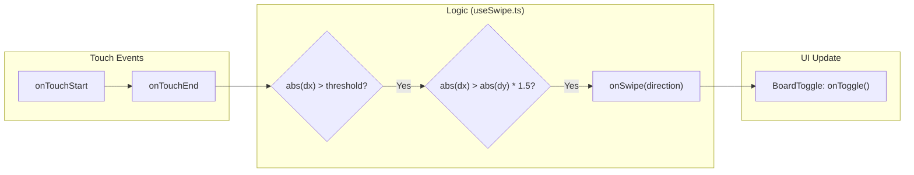

# Hooks & Utilities

<details>
<summary>Relevant source files</summary>

The following files were used as context for generating this wiki page:

- [src/components/BoardToggle.tsx](https://github.com/kllyjsn/battleship/blob/main/src/components/BoardToggle.tsx)
- [src/hooks/useHaptics.ts](https://github.com/kllyjsn/battleship/blob/main/src/hooks/useHaptics.ts)
- [src/hooks/useSwipe.ts](https://github.com/kllyjsn/battleship/blob/main/src/hooks/useSwipe.ts)
- [src/lib/utils.ts](https://github.com/kllyjsn/battleship/blob/main/src/lib/utils.ts)

</details>


The Battleship application utilizes a set of shared React hooks and utility functions to manage sensory feedback, gesture-based inputs, and common UI logic. These tools provide a consistent experience across different game modes (Single Player and Multiplayer) and ensure that the application remains responsive on both desktop and mobile devices.

The system is divided into two primary categories:
1.  **Input & Sensory Hooks**: Custom hooks for touch gestures (`useSwipe`), tactile feedback (`useHaptics`), and audio management (`useSound`, `useBackgroundMusic`).
2.  **Utility Functions**: Helper functions for DOM manipulation (`cn`) and coordinate formatting.

### System Interaction Overview

The following diagram illustrates how these hooks and utilities bridge the gap between user interactions and the application state.

**Interaction to Code Entity Mapping**
```mermaid
graph TD
    subgraph "User Interaction Space"
        "Touch Gesture" --> "Swipe Action"
        "Game Event" --> "Haptic Feedback"
        "UI Event" --> "Class Merging"
    end

    subgraph "Code Entity Space"
        "Swipe Action" -.-> useSwipe["useSwipe.ts"]
        "Haptic Feedback" -.-> useHaptics["useHaptics.ts"]
        "Class Merging" -.-> cn["lib/utils.ts: cn()"]
    end

    useSwipe --> BoardToggle["BoardToggle.tsx"]
    useHaptics --> SinglePlayer["SinglePlayer.tsx"]
    useHaptics --> Multiplayer["Multiplayer.tsx"]
```
Sources: `src/hooks/useSwipe.ts:1-12`, `src/hooks/useHaptics.ts:16-31`, `src/lib/utils.ts:4-6`

---

## 9.1 Input & Gesture Hooks

The application provides specialized hooks to handle the unique constraints of mobile web browsing, specifically for board navigation and ship orientation.

### Gesture Detection
The `useSwipe` hook detects horizontal movement on touch devices. It uses a `threshold` (defaulting to 50px) to distinguish intentional swipes from accidental touches and ensures the horizontal movement (`dx`) is significantly greater than vertical movement (`dy`) before triggering a callback `src/hooks/useSwipe.ts:12-30`. This is primarily used for rotating ships during the placement phase or switching views.

### Tactile Feedback
The `useHaptics` hook wraps the Browser Vibration API to provide physical feedback for game events. It offers a variety of patterns:
*   **tap/light**: Short pulses for UI clicks or misses `src/hooks/useHaptics.ts:18-19, 28-29`.
*   **hit/sunk**: Stronger pulses or double-pulses when a ship is damaged or destroyed `src/hooks/useHaptics.ts:20-23`.
*   **win/lose**: Complex vibration sequences for game conclusions `src/hooks/useHaptics.ts:24-27`.

### Mobile Navigation
Because 10x10 grids are difficult to display side-by-side on small screens, `BoardToggle.tsx` provides a UI interface to switch between the "YOUR FLEET" and "ENEMY WATERS" views `src/components/BoardToggle.tsx:8-35`.

For details, see [Input & Gesture Hooks](#9.1).

**Mobile Input Flow**

Sources: `src/hooks/useSwipe.ts:16-34`, `src/components/BoardToggle.tsx:3-35`

---

## 9.2 Utility Functions

The application maintains a lean set of utilities in `src/lib/utils.ts` to handle recurring logic.

### Tailwind Class Merging
The `cn` (className) utility is the most frequently used helper. It combines `clsx` for conditional class logic with `tailwind-merge` to resolve CSS class conflicts, ensuring that the last-applied Tailwind utility takes precedence `src/lib/utils.ts:4-6`.

### Coordinate Formatting
The application uses a coordinate system (e.g., "A1", "J10") for the Battle Log and UI labels. Utilities (often found in `src/lib/utils.ts` or `src/engine/board.ts`) convert 0-indexed array coordinates into these human-readable nautical labels.

For details, see [Utility Functions](#9.2).

**Utility Hierarchy**
| Function | Source | Purpose |
| :--- | :--- | :--- |
| `cn` | `src/lib/utils.ts:4-6` | Merges Tailwind classes and handles conditional styling. |
| `useHaptics` | `src/hooks/useHaptics.ts:16` | Provides standardized vibration patterns for game events. |
| `useSwipe` | `src/hooks/useSwipe.ts:12` | Abstracted touch handling for horizontal gestures. |

Sources: `src/lib/utils.ts:1-7`, `src/hooks/useHaptics.ts:1-31`, `src/hooks/useSwipe.ts:1-34`

---