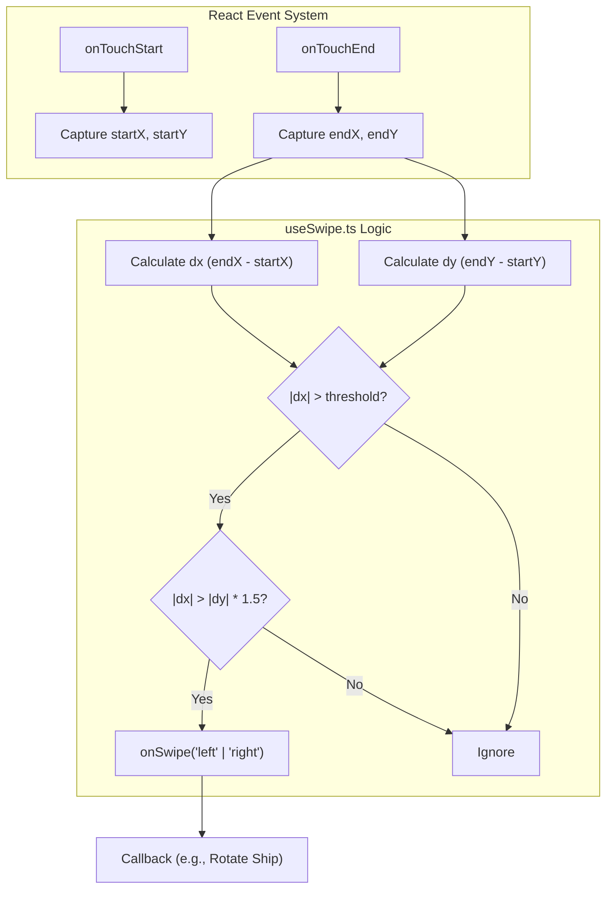
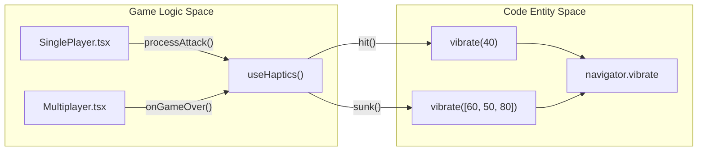
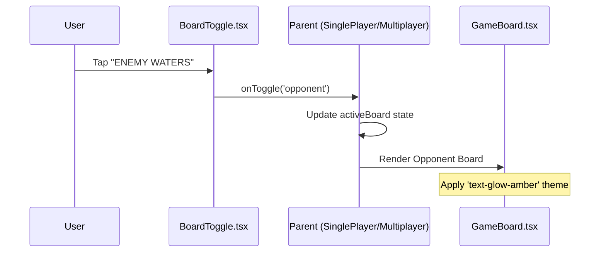

# Input & Gesture Hooks

Relevant source files

The following files were used as context for generating this wiki page:

- [src/components/BoardToggle.tsx](https://github.com/kllyjsn/battleship/blob/main/src/components/BoardToggle.tsx)
- [src/hooks/useHaptics.ts](https://github.com/kllyjsn/battleship/blob/main/src/hooks/useHaptics.ts)
- [src/hooks/useSwipe.ts](https://github.com/kllyjsn/battleship/blob/main/src/hooks/useSwipe.ts)

This section details the specialized hooks and components designed to enhance the mobile user experience and provide tactile feedback during gameplay. These utilities abstract the complexities of the **Vibration API** and **Touch Events** into reusable interfaces for game state transitions.

## Gesture Detection (useSwipe)

The `useSwipe` hook provides a lightweight mechanism for detecting horizontal swipe gestures on touch-enabled devices. In the context of Battleship, this is primarily utilized during the placement phase to allow users to rotate ships or navigate UI elements without relying solely on tap targets.

### Implementation Details
The hook maintains internal state for the starting touch coordinates using `useRef` to avoid unnecessary re-renders. It calculates the delta between the start and end of a touch sequence to determine if a swipe occurred.

*   **Thresholding**: A default threshold of 50 pixels is applied to prevent accidental triggers from minor finger movements `src/hooks/useSwipe.ts:12`.
*   **Directional Validation**: To ensure the gesture was intentional and horizontal, the hook compares the horizontal delta (`dx`) against the vertical delta (`dy`). A swipe is only registered if `|dx|` is more than 1.5 times greater than `|dy|` `src/hooks/useSwipe.ts:28`.

### Data Flow: Touch Interaction
The following diagram illustrates how touch events are processed by `useSwipe.ts` to trigger game logic.

**Swipe Detection Logic**

Sources: `src/hooks/useSwipe.ts:12-34`

---

## Tactile Feedback (useHaptics)

The `useHaptics` hook serves as a wrapper for the browser's `navigator.vibrate` API. It provides a standardized set of vibration patterns that correspond to specific game events, such as hitting a ship or winning a match.

### Haptic Patterns
The hook returns an object containing functions that execute specific millisecond-based patterns `src/hooks/useHaptics.ts:16-31`.

| Function | Pattern (ms) | Usage Context |
| :--- | :--- | :--- |
| `light` | `8` | Subtle UI interactions, button presses. |
| `tap` | `15` | Cell selection or a "miss" result. |
| `hit` | `40` | Successfully hitting an enemy ship. |
| `sunk` | `[60, 50, 80]` | Double-pulse for ship destruction. |
| `win` | `[30, 40, 30, 40, 100]` | Complex rhythmic rumble for victory. |
| `lose` | `[100, 50, 60]` | Heavy thud for defeat. |

### Error Handling
The implementation includes a `try-catch` block to handle environments where the Vibration API might be blocked by browser permissions or simply unsupported by the hardware `src/hooks/useHaptics.ts:7-13`.

**Haptics Architecture**

Sources: `src/hooks/useHaptics.ts:6-31`

---

## Mobile View Orchestration (BoardToggle)

On smaller screens (mobile/tablets), the application uses a "swapped" view because displaying two 10x10 grids side-by-side is spatially prohibitive. The `BoardToggle.tsx` component manages the visibility of the player's own fleet versus the enemy's waters.

### Responsive Behavior
The component utilizes Tailwind CSS utility classes (`flex lg:hidden`) to ensure it only appears on mobile viewports `src/components/BoardToggle.tsx:10`.

### Component Interface
The component accepts the following props:
*   `activeBoard`: A union type `'player' | 'opponent'` representing the currently visible grid `src/components/BoardToggle.tsx:4`.
*   `onToggle`: A callback function triggered when the user switches views `src/components/BoardToggle.tsx:5`.

### Visual Indicators
*   **Your Fleet**: Uses the `Shield` icon and a green glow (`text-glow-green`) when active `src/components/BoardToggle.tsx:15-20`.
*   **Enemy Waters**: Uses the `Crosshair` icon and an amber glow (`text-glow-amber`) when active `src/components/BoardToggle.tsx:25-31`.

**Mobile View State Flow**

Sources: `src/components/BoardToggle.tsx:8-35`

---