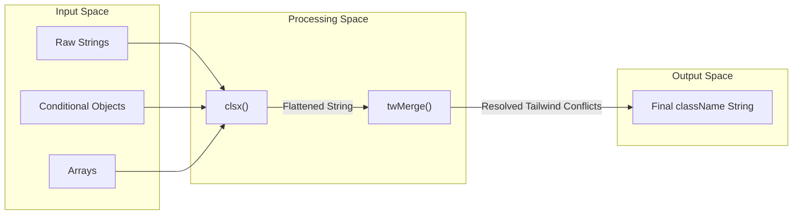
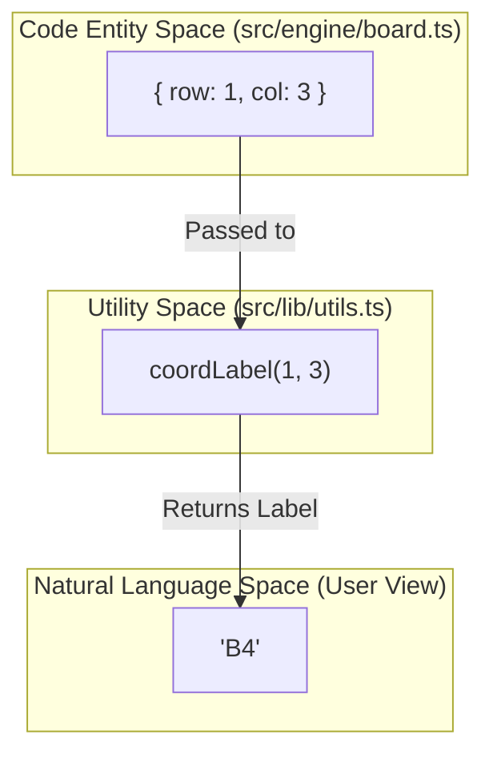

# Utility Functions

Relevant source files

The following files were used as context for generating this wiki page:

- [components.json](https://github.com/kllyjsn/battleship/blob/main/components.json)
- [src/lib/utils.ts](https://github.com/kllyjsn/battleship/blob/main/src/lib/utils.ts)

This page covers the core utility functions used throughout the Battleship application. These helpers provide a standardized way to manage CSS class merging and coordinate formatting, ensuring consistency across both the UI and the Game Engine.

## Styling Utilities

The application utilizes a standardized utility for conditional class name application and Tailwind CSS class merging. This is particularly critical for components like `Cell.tsx` and `GameBoard.tsx`, where styles change dynamically based on game state (e.g., hits, misses, or ship placement validity).

### `cn` Function
The `cn` function is a wrapper that combines `clsx` for conditional logic and `tailwind-merge` to resolve CSS class conflicts. This ensures that the last class provided in the arguments takes precedence if there are overlapping Tailwind utilities.

| Feature | Library | Purpose |
| :--- | :--- | :--- |
| **Conditional Logic** | `clsx` | Allows passing objects or arrays to conditionally apply classes based on boolean flags. |
| **Conflict Resolution** | `tailwind-merge` | Intelligently merges Tailwind classes (e.g., `px-2 px-4` becomes `px-4`). |

**Data Flow: Class Merging**
The following diagram illustrates how raw class inputs are processed into a final string for the DOM.

**Class Merging Pipeline**

Sources: `src/lib/utils.ts:1-6`, `components.json:13-17`

## Coordinate Formatting

While the Game Engine operates on zero-indexed integer coordinates (row: 0-9, col: 0-9), the UI displays these to the user in traditional naval notation (A-J for rows, 1-10 for columns).

### `coordLabel` Utility
This utility (referenced in `BattleLog.tsx` and `GameReplay.tsx`) converts internal coordinate indices into human-readable strings.

*   **Row Transformation**: Converts the row index to a character using `String.fromCharCode(65 + row)`.
*   **Column Transformation**: Converts the 0-indexed column to a 1-indexed number.

**Mapping Table**
| Internal Index (Row, Col) | UI Label | Code Logic |
| :--- | :--- | :--- |
| `(0, 0)` | **A1** | `65 + 0 = 'A'`, `0 + 1 = 1` |
| `(4, 9)` | **E10** | `65 + 4 = 'E'`, `9 + 1 = 10` |
| `(9, 5)` | **J6** | `65 + 9 = 'J'`, `5 + 1 = 6` |

**Entity Relationship: Coordinate Translation**
This diagram bridges the "Natural Language" coordinates used by players with the "Code Entities" used by the engine.

**Coordinate Translation Map**

Sources: `src/lib/utils.ts:1-6`, `src/engine/board.ts:1-20` (implied coordinate structure).

## Project Aliases

The project configuration defines several path aliases to simplify imports and maintain a clean directory structure. These are configured in `components.json` and are used by the build system to resolve the utilities described on this page.

| Alias | Target Path | Usage Example |
| :--- | :--- | :--- |
| `@/lib` | `src/lib` | General library files |
| `@/utils` | `src/lib/utils` | Direct access to `cn` |
| `@/hooks` | `src/hooks` | Shared React hooks |
| `@/components`| `src/components` | UI components |

Sources: `components.json:13-19`

---