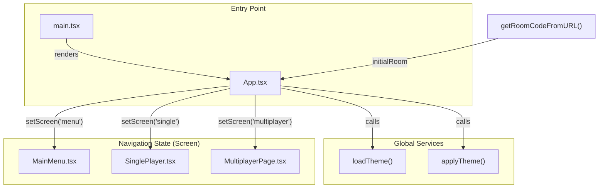
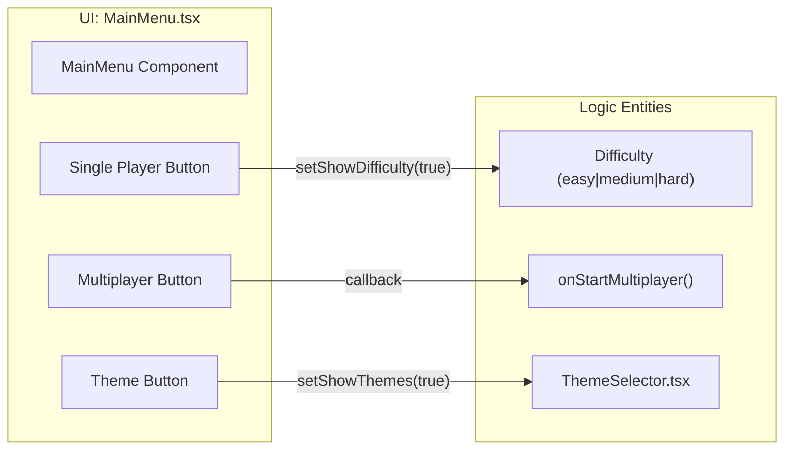

# Overview

Relevant source files

The following files were used as context for generating this wiki page:

- [README.md](https://github.com/kllyjsn/battleship/blob/main/README.md)
- [package.json](https://github.com/kllyjsn/battleship/blob/main/package.json)
- [src/App.tsx](https://github.com/kllyjsn/battleship/blob/main/src/App.tsx)
- [src/components/MainMenu.tsx](https://github.com/kllyjsn/battleship/blob/main/src/components/MainMenu.tsx)
- [src/components/MultiplayerLobby.tsx](https://github.com/kllyjsn/battleship/blob/main/src/components/MultiplayerLobby.tsx)
- [src/main.tsx](https://github.com/kllyjsn/battleship/blob/main/src/main.tsx)

The Battleship web application is a modern, real-time implementation of the classic naval warfare game. Built with a focus on high-fidelity visual effects and responsive gameplay, it supports both single-player combat against a strategic AI and multiplayer matches powered by real-time pub/sub networking.

The application features a distinct "Naval Command Center" aesthetic, utilizing a CRT-style overlay `src/App.tsx:69-70`, procedural sound synthesis, and a comprehensive theme system that adapts the entire UI to different tactical environments.

### Tech Stack
*   **Frontend:** React 18 with TypeScript `package.json:17-18, 39`.
*   **Build Tooling:** Vite `package.json:41`.
*   **Styling:** Tailwind CSS with custom CRT and metal-panel utility classes `package.json:38`.
*   **Networking:** PubNub SDK for real-time multiplayer synchronization `package.json:16`.
*   **Data Visualization:** Recharts for player statistics `package.json:20`.
*   **Icons:** Lucide-React `package.json:15`.

---

### System Architecture

The application is structured as a Single Page Application (SPA) where `App.tsx` serves as the primary state machine controller. It manages the transition between the `MainMenu`, `SinglePlayer` sessions, and `Multiplayer` lobbies.

#### High-Level Component Flow
The following diagram illustrates how the `App` component bootstraps the environment and routes the user based on interaction or URL state.

**Title: Application Bootstrapping and Routing**

**Sources:** `src/main.tsx:1-11`, `src/App.tsx:8-29`, `src/App.tsx:49-64`

---

### Game Modes

The application provides two distinct ways to play, both sharing a common core engine for board validation and attack processing.

| Mode | Orchestrator | Features |
| :--- | :--- | :--- |
| **Single Player** | `SinglePlayer.tsx` | AI opponents with three difficulty levels (`Recruit`, `Captain`, `Admiral`) `src/components/MainMenu.tsx:23-27`. |
| **Multiplayer** | `MultiplayerPage.tsx` | Real-time 1v1 matches, spectator mode, and shareable room links `src/components/MultiplayerLobby.tsx:18-20`. |

#### Mode Selection and Configuration
The `MainMenu` component acts as the "Naval Command Center," providing access to game modes, the `Leaderboard`, `StatsPanel`, and `ThemeSelector` `src/components/MainMenu.tsx:112-132`.

**Title: Main Menu Logic to Code Entity Mapping**

**Sources:** `src/components/MainMenu.tsx:16-21`, `src/components/MainMenu.tsx:57-81`, `src/components/MainMenu.tsx:112-132`

---

### Next Steps

To dive deeper into the technical implementation, configuration, and project structure, refer to the following child pages:

*   **[Getting Started & Configuration](#1.1)**: Instructions for local development, environment variables (PubNub/Supabase), and Vercel deployment.
*   **[Application Entry Point & Navigation](#1.2)**: Detailed breakdown of `App.tsx`, the `Screen` state machine, and URL deep-linking for multiplayer rooms.

**Sources:** `src/App.tsx:1-75`, `src/components/MainMenu.tsx:1-132`, `src/components/MultiplayerLobby.tsx:1-162`

---