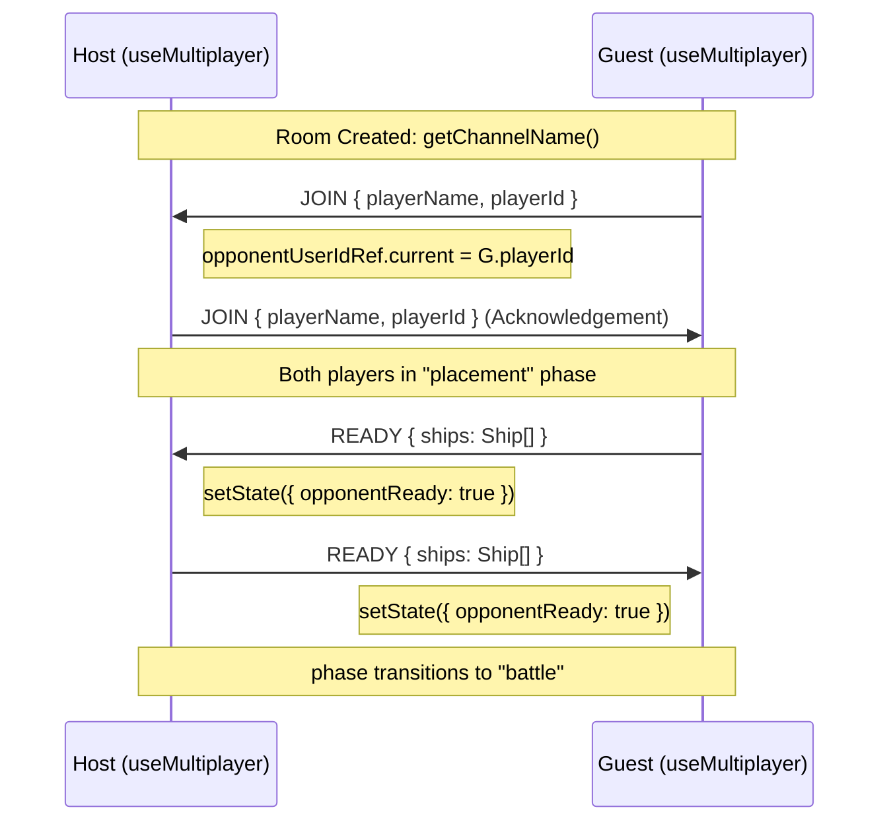
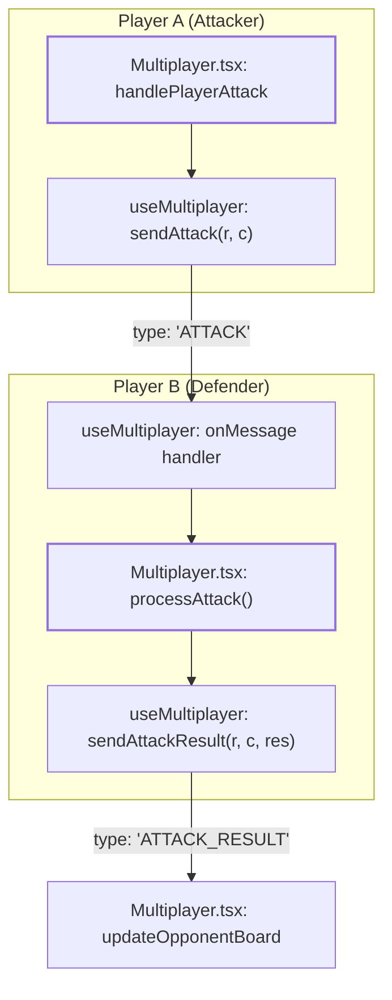

# Multiplayer Message Protocol

Relevant source files

The following files were used as context for generating this wiki page:

- [src/components/BattleLog.tsx](https://github.com/kllyjsn/battleship/blob/main/src/components/BattleLog.tsx)
- [src/engine/types.ts](https://github.com/kllyjsn/battleship/blob/main/src/engine/types.ts)
- [src/multiplayer/pubnub.ts](https://github.com/kllyjsn/battleship/blob/main/src/multiplayer/pubnub.ts)
- [src/multiplayer/useMultiplayer.ts](https://github.com/kllyjsn/battleship/blob/main/src/multiplayer/useMultiplayer.ts)
- [src/pages/Multiplayer.tsx](https://github.com/kllyjsn/battleship/blob/main/src/pages/Multiplayer.tsx)

The Multiplayer Message Protocol defines the structure and sequencing of real-time communication between peers in a Battleship session. Built on top of PubNub's publish/subscribe architecture, the protocol uses a tagged union type, `MultiplayerMessage`, to handle everything from initial handshakes and ship placement synchronization to turn-based combat and spectator updates.

## 1. Message Schema

All communication occurs via the `MultiplayerMessage` interface. This single contract ensures that hosts, guests, and spectators can parse incoming data streams consistently.

### The `MultiplayerMessage` Interface
`src/engine/types.ts:63-86`

| Property | Type | Description |
| :--- | :--- | :--- |
| `type` | `string` | The message discriminator (e.g., `ATTACK`, `READY`). |
| `playerName` | `string` | Display name of the sender. |
| `playerId` | `string` | Unique PubNub UUID of the sender. |
| `ships` | `Ship[]` | Array of ship objects (sent during `READY`). |
| `row` / `col` | `number` | Coordinates for attacks or results. |
| `result` | `string` | Outcome of an attack (`hit`, `miss`, `sunk`). |
| `boardState` | `Board` | Full grid state (sent to spectators). |
| `phase` | `GamePhase` | Current game state (`placement`, `battle`, `gameover`). |

### Message Types Reference
`src/engine/types.ts:64-64`

*   **Handshake**: `JOIN` (Initial connection), `READY` (Ships placed).
*   **Combat**: `ATTACK` (Firing a shot), `ATTACK_RESULT` (Confirming hit/miss).
*   **Social**: `CHAT` (Text message), `REACTION` (Emoji overlay).
*   **System**: `PING` / `PONG` (Heartbeat), `LEAVE` (Graceful exit).
*   **Spectator**: `SPECTATE` (Join as observer), `SPECTATOR_SYNC` (State broadcast).

Sources: `src/engine/types.ts:63-86`, `src/multiplayer/useMultiplayer.ts:151-177`

---

## 2. Connection Lifecycle & Handshake

The protocol governs the transition from a lobby to an active battle through a strict sequencing of `JOIN` and `READY` messages.

### Handshake Sequence Diagram
This diagram maps the `useMultiplayer` logic to the network events required to start a game.

### Implementation Details
*   **Self-Filtering**: The protocol relies on `event.publisher === userIdRef.current` checks to ignore echoed messages `src/multiplayer/useMultiplayer.ts:152-153`.
*   **Identity Tracking**: Upon receiving a `JOIN`, the `opponentUserIdRef` is populated to ensure heartbeats only track the actual opponent, not spectators `src/multiplayer/useMultiplayer.ts:181-183`.

Sources: `src/multiplayer/useMultiplayer.ts:150-210`, `src/multiplayer/pubnub.ts:52-54`

---

## 3. Game Loop & Combat Sequencing

Combat follows a "Request-Response" pattern. The attacking player sends an `ATTACK`, and the defender (who owns the authoritative board state) calculates the result and replies with `ATTACK_RESULT`.

### Combat Data Flow
The following diagram bridges the UI actions in `Multiplayer.tsx` to the messaging logic in `useMultiplayer.ts`.

### Turn Synchronization
*   **Turn Switching**: The `isPlayerTurn` state is toggled locally after sending an `ATTACK` `src/pages/Multiplayer.tsx:160-160` and updated via message when receiving an `ATTACK_RESULT` `src/pages/Multiplayer.tsx:218-218`.
*   **Auto-Attack**: If the `TurnTimer` expires, the client forces a random `ATTACK` message to prevent game stalls `src/pages/Multiplayer.tsx:158-162`.

Sources: `src/pages/Multiplayer.tsx:144-164`, `src/pages/Multiplayer.tsx:210-230`, `src/multiplayer/useMultiplayer.ts:340-360`

---

## 4. Reliability & Heartbeats

Because PubNub is a pub/sub system, the application implements an application-level heartbeat to detect "ghost" connections where a player has closed their browser without sending a `LEAVE` message.

### Heartbeat Mechanism
1.  **Interval**: Every 15 seconds (`PING_INTERVAL_MS`), the client publishes a `PING` `src/multiplayer/useMultiplayer.ts:26-26`.
2.  **Response**: Any peer receiving a `PING` must immediately reply with a `PONG` `src/multiplayer/useMultiplayer.ts:158-166`.
3.  **Timeout**: If a `PONG` is not received within 10 seconds (`PONG_TIMEOUT_MS`), the client sets `isReconnecting: true` to trigger UI warnings `src/multiplayer/useMultiplayer.ts:120-122`.

Sources: `src/multiplayer/useMultiplayer.ts:25-28`, `src/multiplayer/useMultiplayer.ts:105-124`

---

## 5. Spectator Protocol

Spectators utilize a specialized sync flow to reconstruct the game state without being active participants in the handshake.

*   **Joining**: A spectator sends a `SPECTATE` message upon entering the channel `src/multiplayer/useMultiplayer.ts:316-320`.
*   **State Broadcast**: The Host listens for `SPECTATE` and responds with `SPECTATOR_SYNC`. This message contains the `boardState` for both players and the current `phase` `src/pages/Multiplayer.tsx:170-185`.
*   **Privacy**: To prevent cheating, `SPECTATOR_SYNC` only transmits the `visibleBoard` (hits and misses) unless the game is over `src/engine/board.ts:130-145`.

Sources: `src/pages/Multiplayer.tsx:167-190`, `src/multiplayer/useMultiplayer.ts:310-330`

---