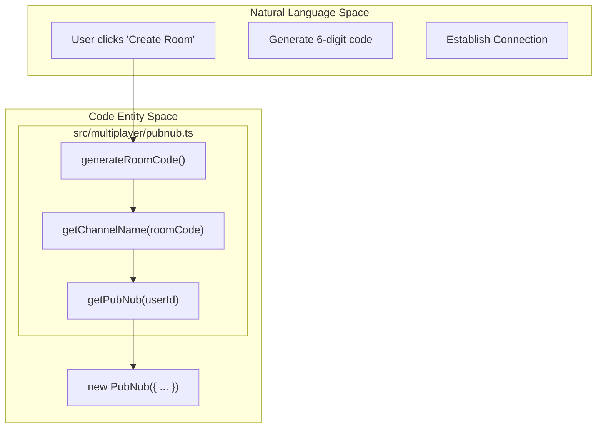
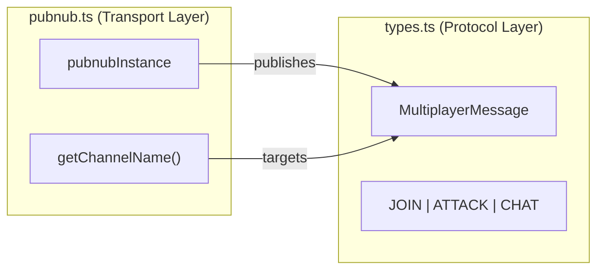

# PubNub Integration & Room Management

Relevant source files

The following files were used as context for generating this wiki page:

- [.env.example](https://github.com/kllyjsn/battleship/blob/main/.env.example)
- [src/components/BattleLog.tsx](https://github.com/kllyjsn/battleship/blob/main/src/components/BattleLog.tsx)
- [src/engine/types.ts](https://github.com/kllyjsn/battleship/blob/main/src/engine/types.ts)
- [src/multiplayer/pubnub.ts](https://github.com/kllyjsn/battleship/blob/main/src/multiplayer/pubnub.ts)

This section details the low-level integration with the PubNub SDK. The application uses PubNub as its real-time messaging backbone to synchronize game states between players and spectators without requiring a custom backend server. The implementation is encapsulated within a utility module that manages the SDK lifecycle, room addressing, and connection persistence.

## SDK Initialization & Singleton Pattern

The application interacts with PubNub through a singleton instance managed in `pubnub.ts`. This ensures that multiple components can access the same network context without creating redundant connections.

### Key Functions

*   **`hasPubNubKeys()`**: Validates the presence of `VITE_PUBNUB_PUBLISH_KEY` and `VITE_PUBNUB_SUBSCRIBE_KEY` in the environment `src/multiplayer/pubnub.ts:9-11`. This is used as a pre-flight check before attempting to initialize the multiplayer sub-system.
*   **`getPubNub(userId: string)`**: Returns the existing `pubnubInstance` or initializes a new one if it doesn't exist `src/multiplayer/pubnub.ts:13-28`.
*   **`resetPubNub()`**: Performs a "hard teardown" of the network layer by removing all listeners, unsubscribing from all channels, and destroying the instance `src/multiplayer/pubnub.ts:30-41`.

### Connection Configuration

The SDK is configured with specific parameters to handle the volatile nature of web-based multiplayer:

| Parameter | Value | Purpose |
| :--- | :--- | :--- |
| `presenceTimeout` | `20` | Detects user disconnects within 20 seconds `src/multiplayer/pubnub.ts:20-20`. |
| `heartbeatInterval` | `9` | Sends a presence signal every 9 seconds to maintain the active lease `src/multiplayer/pubnub.ts:22-22`. |
| `restore` | `true` | Automatically attempts to restore subscriptions after temporary network loss `src/multiplayer/pubnub.ts:24-24`. |

**Sources:**
* `src/multiplayer/pubnub.ts:1-41`

## Room Management & Addressing

Multiplayer sessions are organized into "Rooms," which map directly to PubNub channels. The application uses a human-readable room code system to facilitate easy sharing between players.

### Room Code Generation
The `generateRoomCode` function creates a 6-character alphanumeric string. It specifically excludes ambiguous characters (like `0`, `1`, `I`, `O`) to ensure clarity when shared via text or voice `src/multiplayer/pubnub.ts:43-50`.

### Channel Mapping
The `getChannelName` function transforms a room code into a standardized PubNub channel string: `battleship-game-${roomCode}` `src/multiplayer/pubnub.ts:52-54`. This namespacing prevents collisions with other potential PubNub applications using the same keys.

### Logic Flow: Room Initialization
The following diagram illustrates the transition from "Natural Language" room concepts to the specific code entities used during initialization.

**Room Initialization Logic**

**Sources:**
* `src/multiplayer/pubnub.ts:43-54`

## Data Flow & Lifecycle

The lifecycle of a PubNub session is tied to the multiplayer component's mount state. When a player leaves a game or returns to the main menu, the instance is destroyed to prevent memory leaks and ghost presence signals.

### Teardown Sequence
The `resetPubNub` function executes a specific sequence to ensure a clean exit:
1.  **`removeAllListeners()`**: Stops the application from reacting to incoming messages `src/multiplayer/pubnub.ts:33-33`.
2.  **`unsubscribeAll()`**: Tells the PubNub edge network to stop routing messages to this client `src/multiplayer/pubnub.ts:34-34`.
3.  **`destroy()`**: Clears the internal SDK buffers and timers `src/multiplayer/pubnub.ts:35-35`.
4.  **`pubnubInstance = null`**: Resets the singleton pointer for future sessions `src/multiplayer/pubnub.ts:39-39`.

### Messaging Context
While `pubnub.ts` manages the connection, the structure of the data sent over these channels is defined by the `MultiplayerMessage` type.

**Entity Association: Connection to Protocol**

**Sources:**
* `src/multiplayer/pubnub.ts:30-41`
* `src/engine/types.ts:63-86`

---