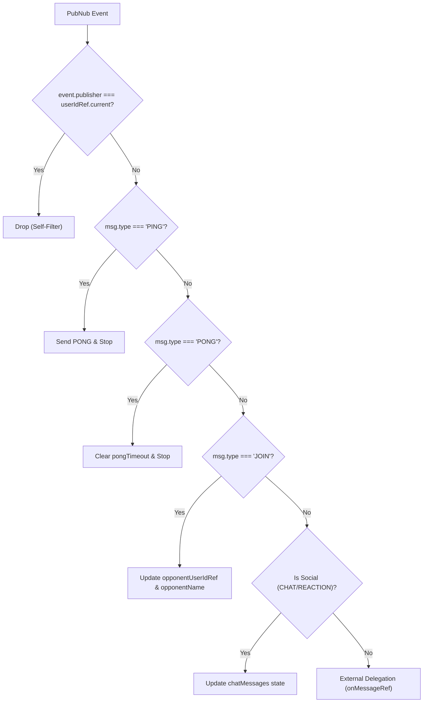

# useMultiplayer Hook

<details>
<summary>Relevant source files</summary>

The following files were used as context for generating this wiki page:

- [src/multiplayer/useMultiplayer.ts](https://github.com/kllyjsn/battleship/blob/main/src/multiplayer/useMultiplayer.ts)

</details>


The `useMultiplayer` hook is the central orchestration layer for networked gameplay. It abstracts the underlying PubNub real-time infrastructure into a reactive state machine, managing room lifecycles, peer-to-peer heartbeats, and a structured message processing pipeline.

## MultiplayerState Interface

The hook maintains a comprehensive state object that reflects the current network and session status.

| Property | Type | Description |
| :--- | :--- | :--- |
| `roomCode` | `string \| null` | The unique 6-character alphanumeric code for the current session. |
| `isHost` | `boolean` | True if the local player created the room. |
| `isConnected` | `boolean` | Indicates if the PubNub subscription is active. |
| `isConnecting` | `boolean` | True during the initial handshake and subscription phase. |
| `opponentName` | `string \| null` | The display name of the connected peer. |
| `isSpectator` | `boolean` | True if the user joined a full room or explicitly as a observer. |
| `occupancy` | `number` | The total number of users currently in the PubNub channel. |
| `isReconnecting`| `boolean` | Flagged when heartbeats (PING/PONG) fail or PubNub reports network issues. |

Sources: `src/multiplayer/useMultiplayer.ts:6-23`, `src/multiplayer/useMultiplayer.ts:31-46`

## Connection Actions

The hook provides three primary entry points for establishing a session. All actions initialize the PubNub singleton via `getPubNub()` and subscribe to a channel derived from the room code.

### createRoom
Generates a new `roomCode` using `generateRoomCode()` and sets `isHost` to `true`. It subscribes to the channel and prepares a `JOIN` message to be sent once the subscription is confirmed.
Sources: `src/multiplayer/useMultiplayer.ts:251-274`, `src/multiplayer/pubnub.ts:25-27`

### joinRoom
Attempts to connect to an existing `roomCode`. It sets `isHost` to `false` and sets an `opponentTimeoutRef` (10 seconds). If no `JOIN` message is received from the host within this window, the connection is considered failed.
Sources: `src/multiplayer/useMultiplayer.ts:276-304`

### joinAsSpectator
Similar to `joinRoom`, but sets the `isSpectator` flag to `true`. Spectators receive game signals to keep their local board state in sync but do not participate in the turn-based logic or PING/PONG heartbeat cycles.
Sources: `src/multiplayer/useMultiplayer.ts:306-334`

## Message Processing Pipeline

Incoming messages pass through a multi-stage filtering and delegation pipeline within the `listener` defined in the `subscribe` function.

### Pipeline Logic Flow
The following diagram illustrates how an incoming PubNub event is processed before reaching the game logic.

**Multiplayer Message Pipeline**

Sources: `src/multiplayer/useMultiplayer.ts:150-230`

## Heartbeat Mechanism (PING/PONG)

To detect "ghost" disconnections where a socket remains open but the peer is unresponsive, the hook implements an application-level heartbeat.

1.  **PING Interval**: Every 15 seconds (`PING_INTERVAL_MS`), the hook publishes a `{ type: 'PING' }` message.
2.  **PONG Timeout**: Upon sending a PING, a 10-second timer (`PONG_TIMEOUT_MS`) is started.
3.  **Resolution**: 
    *   If a `PONG` is received from the `opponentUserIdRef`, the timeout is cleared.
    *   If the timer expires, `isReconnecting` is set to `true`, triggering UI warnings in the `Multiplayer` component.

Sources: `src/multiplayer/useMultiplayer.ts:25-28`, `src/multiplayer/useMultiplayer.ts:105-124`, `src/multiplayer/useMultiplayer.ts:167-177`

## Security and Data Integrity

The hook and the associated protocol enforce a "Fog of War" security model to prevent cheating via network inspection:

*   **Position Withholding**: During the `READY` phase, players do not exchange ship coordinates. Only the `isReady` status is transmitted.
*   **Verification**: Ship positions are only revealed on a per-ship basis when a ship is actually sunk, or at the end of the game.
*   **Attack Resolution**: The `ATTACK` message contains only coordinates. The target client calculates the result (Hit/Miss/Sunk) and returns an `ATTACK_RESULT` message, ensuring the defender remains the authority over their own board.

Sources: `src/engine/types.ts:121-131`, `src/multiplayer/useMultiplayer.ts:233-249`

## Network Status Handling

The hook distinguishes between recoverable interruptions and hard failures:

*   **Recoverable**: `isReconnecting` state is triggered by PubNub's `PNNetworkDownCategory` or a missed `PONG`. The hook automatically attempts to maintain the subscription.
*   **Hard Failure**: If the `opponentTimeoutRef` expires during the initial join, or if a `LEAVE` message is received, the session is considered terminated, and `cleanup()` is invoked.

**Connection State Machine**
```mermaid
stateDiagram-v2
    [*] --> "isConnecting[true]" : "createRoom() / joinRoom()"
    "isConnecting[true]" --> "isConnected[true]" : "PNConnectedCategory"
    "isConnected[true]" --> "isReconnecting[true]" : "PONG Timeout / PNNetworkDown"
    "isReconnecting[true]" --> "isConnected[true]" : "PONG Received / PNNetworkUp"
    "isConnected[true]" --> [*] : "cleanup() / resetPubNub()"
```
Sources: `src/multiplayer/useMultiplayer.ts:336-378`, `src/multiplayer/useMultiplayer.ts:68-92`

---