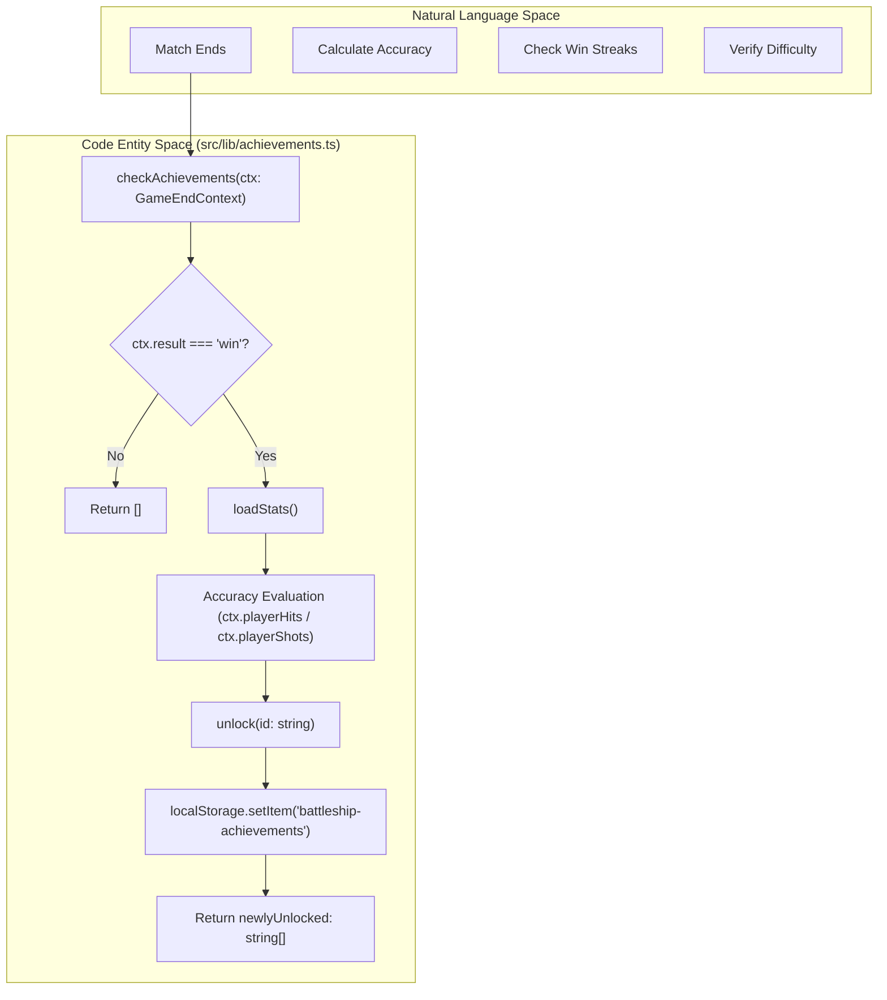
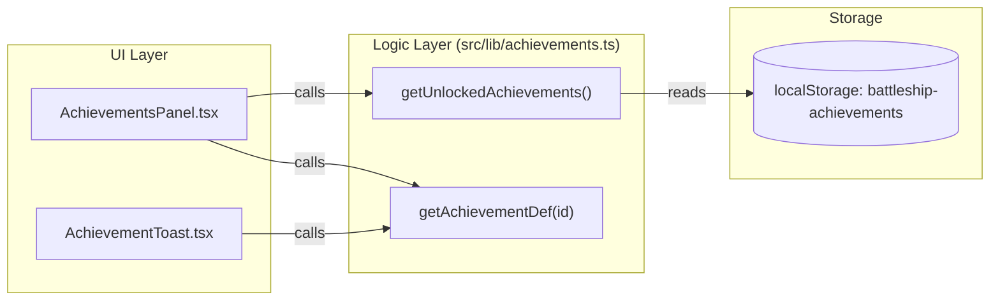

# Achievements System

Relevant source files

The following files were used as context for generating this wiki page:

- [src/components/AchievementToast.tsx](https://github.com/kllyjsn/battleship/blob/main/src/components/AchievementToast.tsx)
- [src/components/AchievementsPanel.tsx](https://github.com/kllyjsn/battleship/blob/main/src/components/AchievementsPanel.tsx)
- [src/lib/achievements.ts](https://github.com/kllyjsn/battleship/blob/main/src/lib/achievements.ts)

The Achievements System provides a gamified progression layer for the Battleship application. It evaluates player performance against predefined criteria at the conclusion of every match, persisting progress locally and providing real-time visual feedback through toasts and a dedicated medals panel.

## Achievement Definitions and Categories

Achievements are defined as static constants and categorized into four functional areas to track different aspects of gameplay. Each achievement is represented by the `AchievementDef` interface `src/lib/achievements.ts:4-10`.

### Achievement Categories
The system uses the following categories `src/lib/achievements.ts:9`:
*   **Combat**: Focused on specific battle outcomes (e.g., winning without losing ships).
*   **Skill**: Focused on efficiency and difficulty (e.g., accuracy thresholds, beating Hard AI).
*   **Social**: Focused on networked play (e.g., winning multiplayer matches).
*   **Milestone**: Focused on long-term progression (e.g., total wins, win streaks).

### The ACHIEVEMENTS Registry
The `ACHIEVEMENTS` constant serves as the single source of truth for all available medals in the game `src/lib/achievements.ts:17-35`.

| ID | Name | Description | Category |
|:---|:---|:---|:---|
| `first_blood` | First Blood | Win your first game | Combat |
| `perfect_game` | Perfect Game | Win without losing a single ship | Combat |
| `demolition_expert` | Demolition Expert | Sink all enemy ships in under 30 shots | Combat |
| `admiral_slayer` | Admiral Slayer | Beat the Admiral (Hard) AI | Skill |
| `speed_demon` | Speed Demon | Win a game in under 2 minutes | Skill |
| `sharpshooter` | Sharpshooter | Win with 80%+ accuracy | Skill |
| `social_butterfly` | Social Butterfly | Win a multiplayer game | Social |
| `untouchable` | Untouchable | Win 5 games in a row | Milestone |
| `streak_master` | Streak Master | Reach a 10-game win streak | Milestone |
| `fleet_commander` | Fleet Commander | Win 50 games total | Milestone |

**Sources:** `src/lib/achievements.ts:4-35`

## Evaluation Pipeline

Achievements are evaluated through the `checkAchievements` function `src/lib/achievements.ts:85-155`. This function is triggered at the end of a game session and requires a `GameEndContext` object to assess the player's performance.

### Evaluation Flow Diagram
This diagram illustrates how the `checkAchievements` function processes game data into unlocked medals.

**Sources:** `src/lib/achievements.ts:70-155`

### Data Requirements
The `GameEndContext` interface provides the necessary metrics for the evaluation pipeline `src/lib/achievements.ts:70-79`:
*   `result`: Must be `'win'` for most achievements to trigger `src/lib/achievements.ts:88`.
*   `mode`: Distinguishes between `'single'` and `'multiplayer'`.
*   `difficulty`: Specifically checks for `'hard'` to trigger `admiral_slayer` `src/lib/achievements.ts:113`.
*   `playerShots` / `playerHits`: Used to calculate accuracy and shot-count efficiency.
*   `durationSeconds`: Used for temporal checks like `speed_demon` (under 120 seconds) `src/lib/achievements.ts:119`.

## Persistence and Utilities

The system persists unlocked achievements in `localStorage` under the key `battleship-achievements` `src/lib/achievements.ts:37`.

### Storage Logic
1.  **`loadUnlocked()`**: Retrieves and parses the `UnlockedAchievement[]` array from local storage `src/lib/achievements.ts:39-47`.
2.  **`saveUnlocked()`**: Stringifies and persists the array `src/lib/achievements.ts:49-51`.
3.  **`unlock(id)`**: Checks if an ID is already present; if not, appends a new `UnlockedAchievement` entry with an ISO timestamp and saves `src/lib/achievements.ts:61-68`.

### Utility Functions
*   **`isAchievementUnlocked(id)`**: Returns a boolean indicating if the specific ID has been earned `src/lib/achievements.ts:57-59`.
*   **`getAchievementDef(id)`**: Retrieves the static definition (name, icon, description) for a given ID `src/lib/achievements.ts:157-159`.

**Sources:** `src/lib/achievements.ts:37-68`, `src/lib/achievements.ts:157-159`

## UI Components

The system utilizes two primary components for displaying achievement data: a notification toast and a comprehensive medals panel.

### AchievementToast
The `AchievementToast` component `src/components/AchievementToast.tsx:9-59` handles the sequential display of newly unlocked achievements. It uses a queueing mechanism to show multiple toasts if a player earns several medals in one match.

*   **Visibility Logic**: Uses a 2.8s display timer (`hideTimer`) followed by a 0.4s transition gap (`nextTimer`) before showing the next achievement in the queue `src/components/AchievementToast.tsx:22-31`.
*   **Styling**: Employs the `metal-panel` class and `text-glow-amber` for a high-contrast military aesthetic `src/components/AchievementToast.tsx:47-53`.

### AchievementsPanel
The `AchievementsPanel` `src/components/AchievementsPanel.tsx:19-121` provides a "Trophy Room" view accessible from the main menu.

*   **Grouping**: Achievements are grouped by their category using the `CATEGORY_ORDER` array `src/components/AchievementsPanel.tsx:17`.
*   **Progress Visualization**: Displays an overall completion percentage and a visual progress bar using CSS variables (e.g., `--hull-dark`) `src/components/AchievementsPanel.tsx:60-68`.
*   **Locked State**: Achievements not yet found in `localStorage` are rendered with a grayscale filter and a lock icon `src/components/AchievementsPanel.tsx:92-93`.

### UI Architecture Diagram

**Sources:** `src/components/AchievementToast.tsx:1-59`, `src/components/AchievementsPanel.tsx:1-121`

---