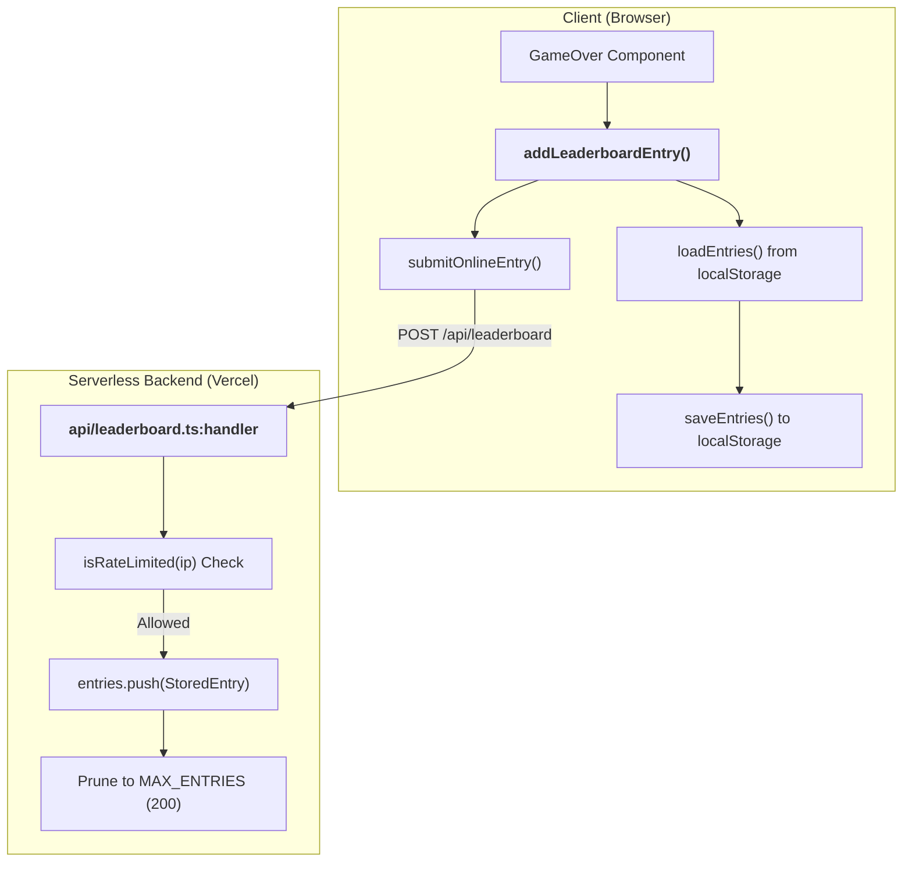
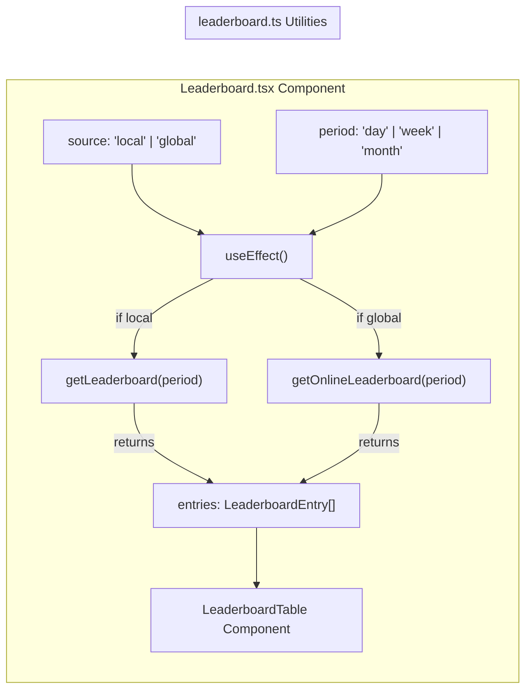

# Leaderboard (Local & Online)

Relevant source files

The following files were used as context for generating this wiki page:

- [api/leaderboard.ts](https://github.com/kllyjsn/battleship/blob/main/api/leaderboard.ts)
- [src/components/Leaderboard.tsx](https://github.com/kllyjsn/battleship/blob/main/src/components/Leaderboard.tsx)
- [src/lib/leaderboard.ts](https://github.com/kllyjsn/battleship/blob/main/src/lib/leaderboard.ts)
- [vercel.json](https://github.com/kllyjsn/battleship/blob/main/vercel.json)

The Battleship application features a dual-layer leaderboard system that persists player performance both locally and globally. This system tracks accuracy-based scores across different time periods and game modes, utilizing a local-first write strategy with a fire-and-forget remote synchronization mechanism.

## Data Model & Scoring

The core of the leaderboard is the `LeaderboardEntry` interface. Scores are calculated as an accuracy percentage (hits divided by total shots), rounded to one decimal place.

### LeaderboardEntry Interface
| Property | Type | Description |
| :--- | :--- | :--- |
| `id` | `string` | Unique identifier generated using timestamp and random string `src/lib/leaderboard.ts:40`. |
| `playerName` | `string` | The callsign entered by the player `src/lib/leaderboard.ts:41`. |
| `score` | `number` | Accuracy percentage (hits/shots * 100) `src/lib/leaderboard.ts:42`. |
| `shots` | `number` | Total number of attacks made `src/lib/leaderboard.ts:43`. |
| `hits` | `number` | Total number of successful hits `src/lib/leaderboard.ts:44`. |
| `mode` | `single \| multiplayer` | The game mode played `src/lib/leaderboard.ts:45`. |
| `difficulty` | `string (optional)` | AI difficulty (easy/medium/hard) for single player `src/lib/leaderboard.ts:46`. |
| `durationSeconds`| `number` | Total game time in seconds `src/lib/leaderboard.ts:47`. |
| `date` | `string` | ISO timestamp of the entry `src/lib/leaderboard.ts:48`. |

**Sources:** `src/lib/leaderboard.ts:1-11`, `src/lib/leaderboard.ts:39-49`

## Submission Flow

Entries are submitted via `addLeaderboardEntry`. This function follows a local-first pattern to ensure data is saved even if the network is unavailable.

1.  **Local Write:** The entry is pushed to `localStorage` under the key `battleship-leaderboard` `src/lib/leaderboard.ts:13-27`.
2.  **Remote Sync:** The function calls `submitOnlineEntry`, which performs a `POST` request to the `/api/leaderboard` endpoint `src/lib/leaderboard.ts:109-123`.
3.  **Fire-and-Forget:** The remote submission is wrapped in a `catch` block to fail silently, ensuring the user experience is not interrupted by API issues `src/lib/leaderboard.ts:56-127`.

### Leaderboard Submission Logic
"The diagram below illustrates the flow from a finished game to the local and remote persistence layers."

**Sources:** `src/lib/leaderboard.ts:29-59`, `src/lib/leaderboard.ts:109-127`, `api/leaderboard.ts:35-76`

## Retrieval & Filtering

The system supports filtering by three time periods: `day`, `week`, and `month` `src/lib/leaderboard.ts:61`.

### Sorting Logic
Both the local `getLeaderboard` and the remote API handler implement a multi-level sort:
1.  **Primary Sort:** `score` (Accuracy %) descending `src/lib/leaderboard.ts:95`.
2.  **Secondary Sort:** `shots` ascending (fewer shots for the same accuracy ranks higher) `src/lib/leaderboard.ts:96`.

Results are truncated to the **top 50** entries `src/lib/leaderboard.ts:98`, `api/leaderboard.ts:105`.

### Leaderboard UI Logic
"The following diagram maps the UI state management to the data retrieval functions."

**Sources:** `src/components/Leaderboard.tsx:90-110`, `src/lib/leaderboard.ts:87-99`, `src/lib/leaderboard.ts:129-138`

## Backend Implementation (`api/leaderboard.ts`)

The backend is a Vercel serverless function that provides a volatile in-memory store for global scores.

### Key Features:
*   **In-Memory Store:** Uses a simple array `entries` `api/leaderboard.ts:17`. This resets on serverless cold starts but is sufficient for demo purposes.
*   **Rate Limiting:** Tracks IP addresses via `x-forwarded-for` and limits submissions to 10 per minute per IP using `rateMap` `api/leaderboard.ts:21-33`.
*   **CORS Support:** Explicitly handles `OPTIONS` preflight and sets `Access-Control-Allow-Origin: *` to allow cross-origin requests from the web client `api/leaderboard.ts:36-43`.
*   **Data Sanitization:** Truncates `playerName` to 20 characters and ensures numeric types for scores and shots `api/leaderboard.ts:58-60`.
*   **Auto-Pruning:** Maintains a maximum of 200 total entries to prevent memory exhaustion `api/leaderboard.ts:18, 71-73`.

### API Endpoints
| Method | Endpoint | Query Params | Description |
| :--- | :--- | :--- | :--- |
| `POST` | `/api/leaderboard` | N/A | Submits a new score. Returns 429 if rate limited `api/leaderboard.ts:45-76`. |
| `GET` | `/api/leaderboard` | `period` | Retrieves top 50 scores for the specified period `api/leaderboard.ts:78-106`. |

**Sources:** `api/leaderboard.ts:1-110`, `vercel.json:1-7`

---