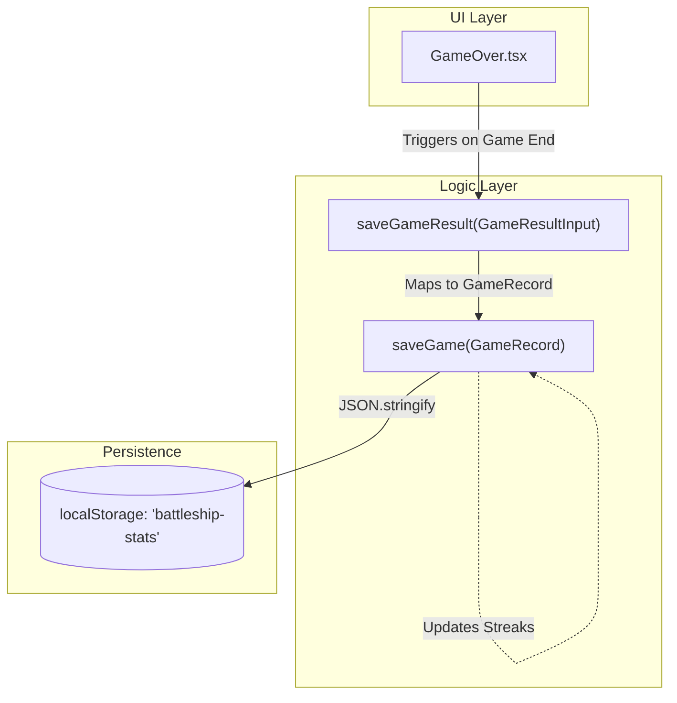
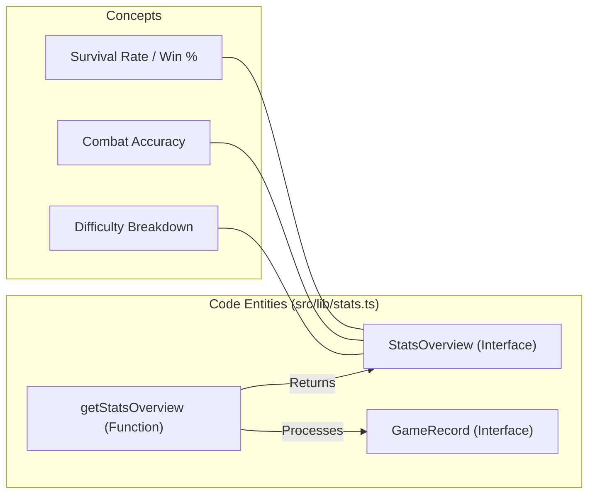

# Stats & Game Results

Relevant source files

The following files were used as context for generating this wiki page:

- [src/components/StatsPanel.tsx](https://github.com/kllyjsn/battleship/blob/main/src/components/StatsPanel.tsx)
- [src/lib/gameResults.ts](https://github.com/kllyjsn/battleship/blob/main/src/lib/gameResults.ts)
- [src/lib/stats.ts](https://github.com/kllyjsn/battleship/blob/main/src/lib/stats.ts)

The Battleship application features a comprehensive persistence layer for tracking player performance across both single-player and multiplayer modes. This system records game outcomes, calculates performance metrics like accuracy and win rates, and manages win streaks using local storage.

## Data Models

The statistics system is built around two primary interfaces defined in `src/lib/stats.ts`: `GameRecord` and `Stats`.

### GameRecord
Represents the outcome of a single match.
*   **date**: ISO string timestamp of the game completion `src/lib/stats.ts:2`.
*   **mode**: Discriminator between `single` and `multiplayer` `src/lib/stats.ts:3`.
*   **difficulty**: Optional field for single-player games (`easy`, `medium`, `hard`) `src/lib/stats.ts:4`.
*   **result**: Outcome of the match (`win` or `loss`) `src/lib/stats.ts:5`.
*   **playerShots / playerHits**: Raw numbers used to calculate accuracy `src/lib/stats.ts:6-7`.

### Stats
The root object stored in the browser's `localStorage`.
*   **games**: An array of `GameRecord` objects `src/lib/stats.ts:13`.
*   **currentWinStreak**: The number of consecutive wins up to the most recent game `src/lib/stats.ts:14`.
*   **bestWinStreak**: The historical maximum win streak achieved `src/lib/stats.ts:15`.

**Sources:** `src/lib/stats.ts:1-16`

---

## Game Result Recording Pipeline

When a game concludes, the application uses a two-step process to persist the result. 

1.  **Input Normalization**: `saveGameResult` in `src/lib/gameResults.ts` accepts a `GameResultInput` object `src/lib/gameResults.ts:13`. This function acts as a wrapper that injects the current timestamp before passing the data to the lower-level stats engine `src/lib/gameResults.ts:14-23`.
2.  **Persistence & Streak Logic**: The `saveGame` function in `src/lib/stats.ts` performs the actual write operation `src/lib/stats.ts:39`.

### Win-Streak Logic
Inside `saveGame`, the system updates streaks based on the `result` field:
*   If `win`: Increments `currentWinStreak`. If the new value exceeds `bestWinStreak`, the latter is updated `src/lib/stats.ts:43-47`.
*   If `loss`: Resets `currentWinStreak` to 0 `src/lib/stats.ts:48-50`.

### Storage Mechanism
The data is serialized to JSON and stored under the key `'battleship-stats'` `src/lib/stats.ts:18,52`.

**Game Result Data Flow**
Title: Game Result Persistence Flow

**Sources:** `src/lib/gameResults.ts:3-24`, `src/lib/stats.ts:39-54`

---

## Stats Aggregation & Overview

To display meaningful data in the UI without re-calculating raw arrays on every render, the system uses `getStatsOverview`. This function transforms the raw `Stats` object into a `StatsOverview` object `src/lib/stats.ts:69`.

### Aggregation Metrics
| Metric | Calculation Logic |
| :--- | :--- |
| **Win Rate** | `(wins / totalGames) * 100` `src/lib/stats.ts:73` |
| **Accuracy** | `(totalHits / totalShots) * 100` `src/lib/stats.ts:77` |
| **perDifficulty** | A map of `easy`, `medium`, and `hard` containing specific W/L counts for single-player `src/lib/stats.ts:79-83,89-94` |
| **multiplayerWins** | Filtered count where `mode === 'multiplayer'` and `result === 'win'` `src/lib/stats.ts:85-86` |

**Stats Aggregation Mapping**
Title: Natural Language to Code Entity Mapping (Stats)

**Sources:** `src/lib/stats.ts:56-108`

---

## UI Integration: StatsPanel

The `StatsPanel.tsx` component provides the visual representation of the aggregated data. It utilizes `recharts` to render a bar chart of wins across different difficulties `src/components/StatsPanel.tsx:3,74-103`.

### Implementation Details
*   **Memoization**: The component uses `useMemo` to call `getStatsOverview(loadStats())` only once when the panel opens `src/components/StatsPanel.tsx:11`.
*   **Conditional Rendering**: If `totalGames` is 0, it displays a "No games played" placeholder `src/components/StatsPanel.tsx:41-44`.
*   **Visual Indicators**:
    *   **Win Rate**: Displayed as a percentage with one decimal point `src/components/StatsPanel.tsx:16,55`.
    *   **W/L Ratio**: Color-coded using `text-glow-green` for wins and `text-glow-red` for losses `src/components/StatsPanel.tsx:60-62`.
    *   **Difficulty Chart**: A `BarChart` mapping `Recruit` (easy), `Captain` (medium), and `Admiral` (hard) to their respective win counts `src/components/StatsPanel.tsx:19-23,75`.

**Sources:** `src/components/StatsPanel.tsx:10-124`

---

## Utility Functions

### loadStats
Retrieves the stats from `localStorage`. It includes a `try-catch` block to handle corrupted JSON and provides a `defaultStats` fallback (empty games array and zeroed streaks) if no data exists `src/lib/stats.ts:24-37`.

### clearStats
Provides a mechanism to reset all player progress by removing the `STORAGE_KEY` from `localStorage` `src/lib/stats.ts:110-112`.

**Sources:** `src/lib/stats.ts:20-22,110-112`

---