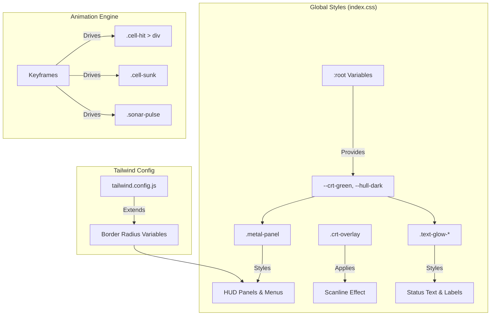
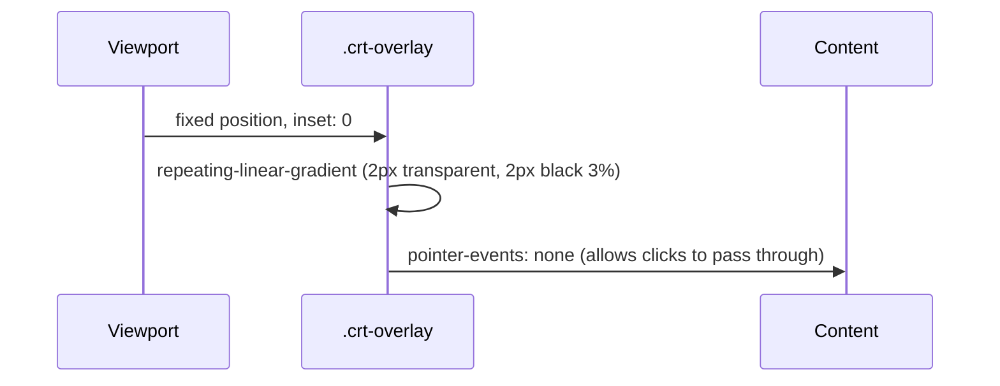

# Global Styles & Tailwind Setup

Relevant source files

The following files were used as context for generating this wiki page:

- [postcss.config.js](https://github.com/kllyjsn/battleship/blob/main/postcss.config.js)
- [src/App.css](https://github.com/kllyjsn/battleship/blob/main/src/App.css)
- [src/index.css](https://github.com/kllyjsn/battleship/blob/main/src/index.css)
- [tailwind.config.js](https://github.com/kllyjsn/battleship/blob/main/tailwind.config.js)

This section details the visual architecture of the Battleship application, focusing on the global CSS definitions, Tailwind CSS extensions, and the specialized animations that create the "tactical naval console" aesthetic.

## Overview of Visual Architecture

The application uses a hybrid styling approach. **Tailwind CSS** provides utility-first layout and spacing, while **src/index.css** defines the core "metal and CRT" aesthetic through custom CSS variables, complex gradients, and keyframe animations.

### The CRT Aesthetic Pipeline

The "retro-tech" look is achieved through a layered approach:
1.  **Base Layer**: Dark backgrounds and `metal-panel` gradients `src/index.css:71-87`.
2.  **Typography Layer**: High-contrast monospace fonts (`Share Tech Mono`) with glowing text shadows `src/index.css:172-190`.
3.  **Overlay Layer**: A fixed-position `crt-overlay` that provides a subtle scanline effect across the entire viewport `src/index.css:56-68`.

### Visual Entity Mapping

The following diagram maps CSS classes and variables to their functional roles within the UI.

**Style to UI Mapping**

**Sources:** `src/index.css:13-41`, `src/index.css:71-78`, `src/index.css:172-185`, `tailwind.config.js:5-14`

---

## Tailwind Configuration

The project utilizes Tailwind CSS for its utility classes, with specific extensions to support the custom design system.

### Custom Extensions
The configuration extends the default theme primarily to bridge Tailwind utilities with the CSS variables defined in the global stylesheet.

| Extension | Implementation | Purpose |
| :--- | :--- | :--- |
| **Border Radius** | `var(--radius)` | Syncs Tailwind's `rounded-*` classes with the global theme radius `tailwind.config.js:7-11`. |
| **Content** | `./src/**/*.{ts,tsx}` | Ensures the JIT compiler scans all React components `tailwind.config.js:4`. |
| **Plugins** | `tailwindcss-animate` | Adds support for standard entrance/exit animations `tailwind.config.js:15`. |

**Sources:** `tailwind.config.js:1-18`

---

## Global CSS & Custom Classes

### Metal Panel Textures
To simulate a physical naval console, two primary panel variants are defined using linear gradients and inset box shadows.

*   **`.metal-panel`**: A darker variant using `--hull-mid` to `--hull-dark` `src/index.css:71-78`.
*   **`.metal-panel-light`**: A lighter variant for elevated UI elements `src/index.css:80-87`.
*   **`.riveted-border`**: Uses a `repeating-linear-gradient` as a `border-image` to simulate industrial rivets `src/index.css:89-97`.

### CRT Overlay & Scanlines
The `crt-overlay` class creates the signature retro look. It is applied to a `div` that covers the entire screen.

**Sources:** `src/index.css:56-68`

---

## Animation System

The application uses CSS keyframes for game-state feedback, ranging from UI pulses to combat effects.

### Combat Keyframes
These animations are triggered by state changes in `Cell.tsx` and `GameBoard.tsx`.

| Class / Keyframe | Behavior | File Reference |
| :--- | :--- | :--- |
| `hitExplosion` | Scales from 0 to 1.5 with opacity fade | `src/index.css:119-123` |
| `missRipple` | A scaling ripple effect for water misses | `src/index.css:125-128` |
| `sunkFlash` | Rapid background color oscillation (Red) | `src/index.css:130-134` |
| `sinkingSequence`| Combines color shift with a horizontal shake | `src/index.css:221-229` |
| `bubbleRise` | Simulates air bubbles escaping a sunken ship | `src/index.css:241-244` |

### UI & Environmental Animations
*   **`sonarPulse`**: A scaling circle used for the Sonar utility, fading as it expands `src/index.css:105-108`.
*   **`glowPulse`**: A subtle opacity oscillation (0.6 to 1.0) used for turn indicators `src/index.css:141-144`.
*   **`cursorBlink`**: Mimics a terminal cursor for keyboard-based grid navigation `src/index.css:251-261`.

**Sources:** `src/index.css:100-117`, `src/index.css:141-169`, `src/index.css:211-248`

---

## Theme Variable Integration

The `index.css` file defines default "Classic" theme variables under `:root`. These are dynamically overridden by the theme system (see Section 8.1) but serve as the baseline for the application's appearance.

### Core Color Tokens
*   **Surface**: `--board-bg` (#0a0e1a), `--cell-empty` (#0d1520) `src/index.css:27-29`.
*   **Status**: `--cell-hit` (Red alpha), `--cell-miss` (#111a28), `--cell-sunk` (Dark red) `src/index.css:31-33`.
*   **Interface**: `--crt-green` (#39ff14), `--crt-amber` (#ffb000) `src/index.css:17-20`.

**Sources:** `src/index.css:13-41`

---