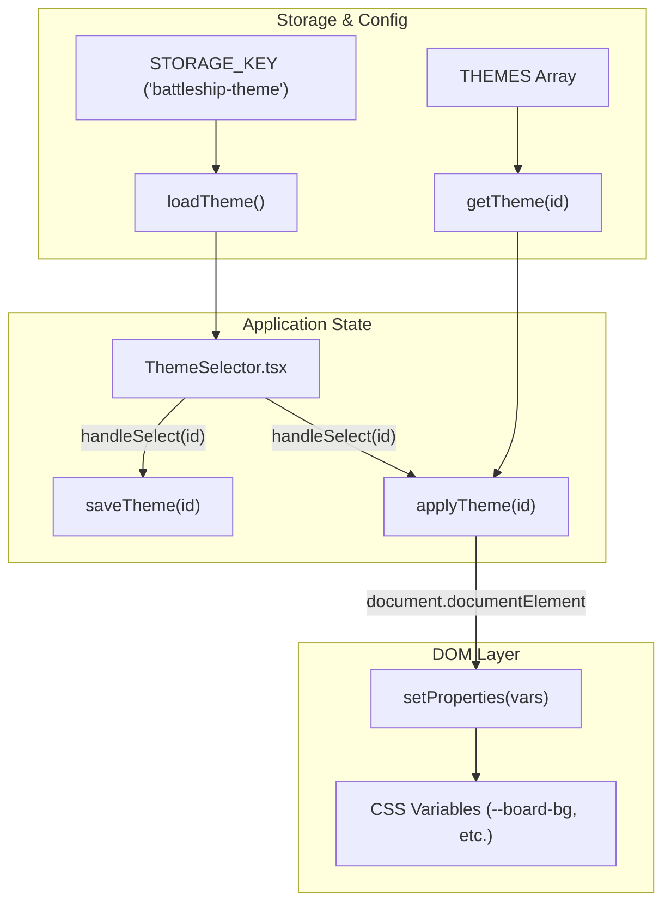
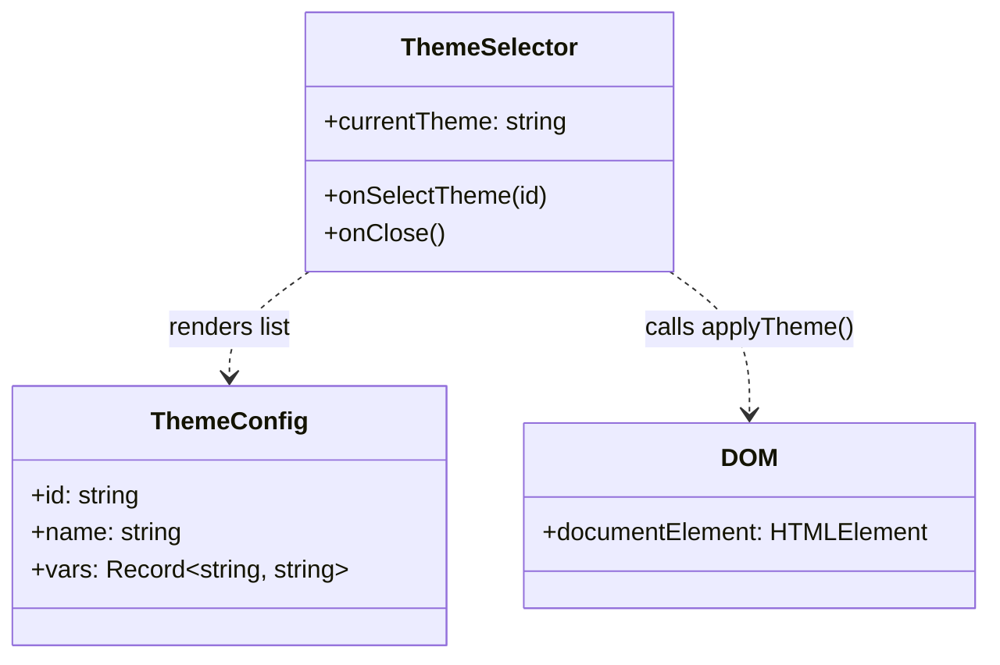

# Theming & Visual Design

Relevant source files

The following files were used as context for generating this wiki page:

- [src/App.css](https://github.com/kllyjsn/battleship/blob/main/src/App.css)
- [src/components/ThemeSelector.tsx](https://github.com/kllyjsn/battleship/blob/main/src/components/ThemeSelector.tsx)
- [src/index.css](https://github.com/kllyjsn/battleship/blob/main/src/index.css)
- [src/lib/themes.ts](https://github.com/kllyjsn/battleship/blob/main/src/lib/themes.ts)
- [tailwind.config.js](https://github.com/kllyjsn/battleship/blob/main/tailwind.config.js)

The Battleship application features a robust theming system built on CSS variable injection and global aesthetic tokens. The design language emphasizes a retro-military "Naval Command" aesthetic, utilizing CRT scanlines, metallic textures, and glow effects to immerse the player in a tactical simulation environment.

## Theme System Architecture

The theming engine decouples visual styles from component logic by using a centralized `ThemeConfig` interface. This allows for real-time switching of the entire application's color palette without re-rendering the component tree, as the system modifies CSS custom properties directly on the document root.

### Core Logic Flow
The system manages theme state through a combination of local storage for persistence and direct DOM manipulation for performance.

### Built-in Themes
The application provides four distinct visual profiles defined in `src/lib/themes.ts`:

| Theme ID | Name | Description | Key Aesthetic |
|:---|:---|:---|:---|
| `classic` | **Classic CRT** | Dark blue/green retro terminal | Default high-contrast green text on dark blue. |
| `sonar` | **Sonar** | Dark green high-contrast sonar | Deep forest greens and neon highlights. |
| `satellite` | **Satellite** | Blue ocean with white grid lines | Modern naval tactical map aesthetic. |
| `arctic` | **Arctic** | Ice blue and white palette | Light-mode alternative with high visibility. |

**Sources:**
- `src/lib/themes.ts:1-93` (ThemeConfig and THEMES array)
- `src/lib/themes.ts:105-127` (Persistence and DOM application)

---

## Global Aesthetic Tokens

The visual identity is anchored by a set of global CSS classes and animations defined in the main stylesheet. These tokens provide consistent textures and behaviors across all UI panels and game boards.

### Visual Effects & Textures
*   **Metal Panels**: Classes like `.metal-panel` and `.metal-panel-light` use linear gradients and inset box shadows to simulate physical hardware `src/index.css:71-87`.
*   **CRT Overlay**: A fixed-position `div` with the `.crt-overlay` class applies a repeating linear gradient to simulate retro monitor scanlines `src/index.css:56-68`.
*   **Text Glows**: Variants such as `.text-glow-green`, `.text-glow-amber`, and `.text-glow-red` use `text-shadow` to create a phosphorescent terminal effect `src/index.css:172-186`.
*   **Typography**: The `.font-mono-crt` class utilizes 'Share Tech Mono' to maintain the technical readout appearance `src/index.css:188-190`.

### Animation System
The UI utilizes several keyframe animations to provide tactical feedback:
*   **Sonar Pulse**: `.sonar-pulse` creates a scaling opacity ring `src/index.css:105-116`.
*   **Cell Feedback**: Specific animations for `.cell-hit` (explosion), `.cell-miss` (ripple), and `.cell-sunk` (flashing sequence) `src/index.css:151-162`.
*   **Interaction**: The `.cell-cursor` provides a blinking border for keyboard navigation `src/index.css:251-261`.

**Sources:**
- `src/index.css:56-117` (Overlays and Sonar animations)
- `src/index.css:119-149` (Cell and transition animations)
- `src/index.css:172-190` (Glows and Fonts)

---

## Theme Selection UI

The `ThemeSelector` component provides the interface for users to browse and activate themes. It features a **3x3 Preview Grid** for each theme, which programmatically maps the theme's CSS variables to a miniature board representation.

The preview grid displays `cell-hit`, `cell-miss`, `cell-ship`, and `cell-sunk` states simultaneously, allowing users to see exactly how game elements will appear before selecting a theme `src/components/ThemeSelector.tsx:52-68`.

**Sources:**
- `src/components/ThemeSelector.tsx:10-17` (Selection handler)
- `src/components/ThemeSelector.tsx:52-68` (Preview grid implementation)

---

## Detailed Design Specifications

For deeper technical implementation details, refer to the following child pages:

### [Theme Configuration & CSS Variables](#8.1)
Detailed reference of the `ThemeConfig` interface, the full mapping of CSS custom properties (e.g., `--board-bg`, `--cell-ship`), and the logic within `applyTheme` that updates the document styles.

### [Global Styles & Tailwind Setup](#8.2)
Deep dive into `src/index.css` and `tailwind.config.js`. Covers the implementation of the CRT scanline effect, the sonar sweep keyframes, and how Tailwind's theme is extended to support the custom border radii and utility classes used by the game.

---