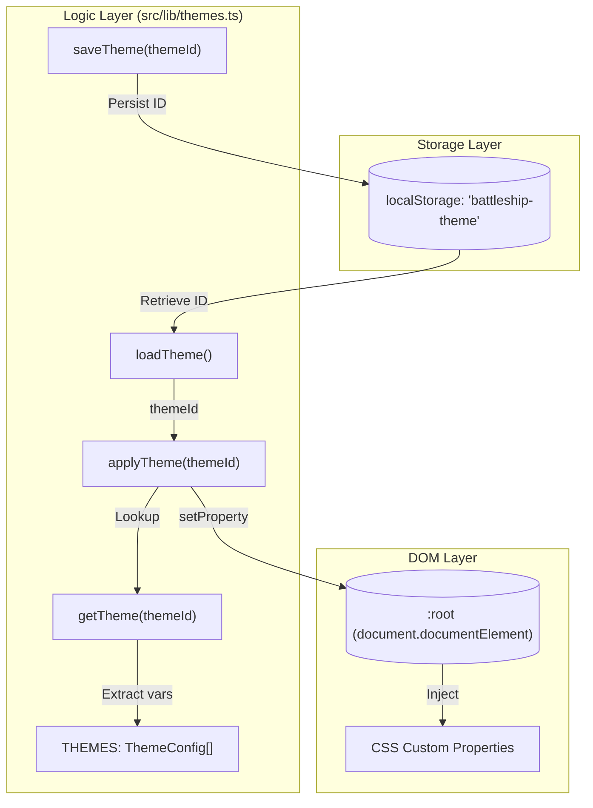
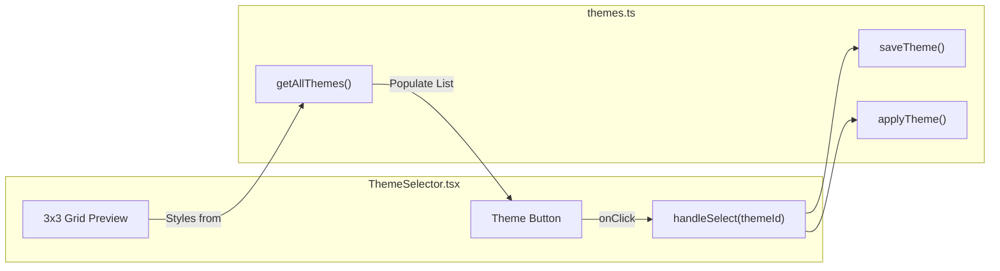

# Theme Configuration & CSS Variables

Relevant source files

The following files were used as context for generating this wiki page:

- [src/components/ThemeSelector.tsx](https://github.com/kllyjsn/battleship/blob/main/src/components/ThemeSelector.tsx)
- [src/index.css](https://github.com/kllyjsn/battleship/blob/main/src/index.css)
- [src/lib/themes.ts](https://github.com/kllyjsn/battleship/blob/main/src/lib/themes.ts)

The Battleship application employs a dynamic theming system built on CSS custom properties (variables). This system allows for real-time visual transformation of the game boards, cells, and UI text without requiring component re-renders or CSS-in-JS overhead. Themes are persisted locally and applied globally to the document root.

### Theme Data Structure

The system is centered around the `ThemeConfig` interface and the `THEMES` constant. Each theme defines a set of color tokens that map directly to CSS variables used throughout the application's stylesheets.

| Property | Type | Description |
| :--- | :--- | :--- |
| `id` | `string` | Unique identifier for the theme (e.g., 'classic', 'sonar'). |
| `name` | `string` | Display name shown in the UI. |
| `description` | `string` | Short summary of the visual style. |
| `vars` | `Record<string, string>` | Key-value pairs of CSS variable names and their color values. |

**Sources:** `src/lib/themes.ts:1-6`, `src/lib/themes.ts:8-93`

### CSS Variable Tokens

The following variables are managed by the theme system and applied to `document.documentElement`. They primarily control the appearance of the `GameBoard` and `Cell` components.

| Variable | Purpose |
| :--- | :--- |
| `--board-bg` | Background color of the 10x10 grid container. |
| `--board-border` | Outer border color of the board. |
| `--cell-empty` | Default background for a cell with no ship or attack. |
| `--cell-empty-border` | Border color for empty cells. |
| `--cell-hit` | Background color for a cell containing a damaged ship segment. |
| `--cell-miss` | Background color for a cell where an attack missed. |
| `--cell-sunk` | Background color for a cell belonging to a completely destroyed ship. |
| `--cell-ship` | Background color for visible ships (ally board or revealed enemy). |
| `--cell-ship-border` | Border color for ship segments. |
| `--grid-line` | Color of the lines separating cells. |
| `--cell-hover` | Background highlight when hovering over a cell. |
| `--cell-hover-border` | Border highlight for the hovered cell. |
| `--text-primary` | Primary HUD text color (often used for glow effects). |
| `--text-secondary` | Dimmer text color for secondary labels. |

**Sources:** `src/lib/themes.ts:14-28`, `src/index.css:27-41`

### Theme Management Lifecycle

The theme system handles loading, saving, and DOM injection. The default fallback theme is `classic` if no preference is found in storage.

**Data Flow & Code Entities**
The following diagram illustrates how theme data moves from storage to the visual layer.

**Theme Injection Pipeline**

**Sources:** `src/lib/themes.ts:95-127`

### Implementation Details

#### applyTheme Function
The `applyTheme` function is the core engine for visual updates. It retrieves the `ThemeConfig` by ID and iterates through the `vars` record, calling `root.style.setProperty` for each entry. This ensures that any component using `var(--token-name)` updates immediately.

**Source:** `src/lib/themes.ts:121-127`

#### Persistence
Themes are persisted using the `localStorage` key `battleship-theme`.
*   **Load:** `loadTheme()` attempts to fetch the ID; defaults to `'classic'` on failure or if empty. `src/lib/themes.ts:105-111`
*   **Save:** `saveTheme(themeId)` updates the entry in `localStorage`. `src/lib/themes.ts:113-119`

### Theme Selection UI

The `ThemeSelector` component provides a 3x3 preview grid for each theme, allowing users to see how board elements (hits, misses, ships, sunk status) will look before selecting.

**UI to Code Mapping**

**Sources:** `src/components/ThemeSelector.tsx:13-17`, `src/components/ThemeSelector.tsx:37-68`

### Built-in Themes

| ID | Name | Description | Key Aesthetic |
| :--- | :--- | :--- | :--- |
| `classic` | Classic CRT | Dark blue/green retro terminal | High-contrast green text on deep blue. |
| `sonar` | Sonar | Dark green high-contrast sonar | Monochromatic green palette. |
| `satellite` | Satellite | Blue ocean with white grid lines | Modern nautical aesthetic with light blue text. |
| `arctic` | Arctic | Ice blue and white palette | Light mode alternative with frosty blues. |

**Sources:** `src/lib/themes.ts:9-92`

### Global Aesthetic Classes
Beyond the variables, the system utilizes global CSS classes defined in `index.css` that leverage these tokens:
*   `.text-glow-green`: Uses `var(--crt-green)` and text-shadows for a terminal effect. `src/index.css:172-175`
*   `.metal-panel`: Uses `var(--hull-mid)` and `var(--hull-dark)` for a brushed metal UI texture. `src/index.css:71-78`
*   `.cell-cursor`: Uses `var(--crt-green)` for the keyboard navigation highlight. `src/index.css:251-261`

---