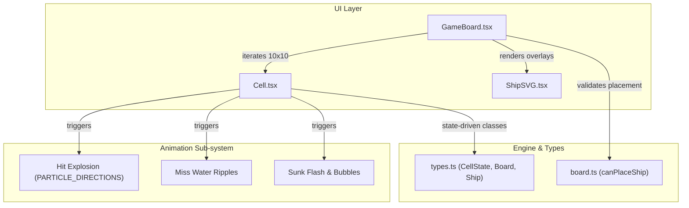
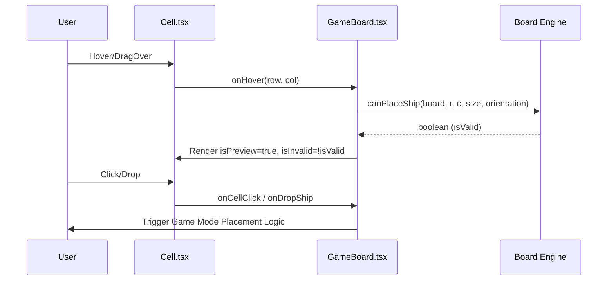

# Board & Cell Rendering

Relevant source files

The following files were used as context for generating this wiki page:

- [src/components/Cell.tsx](https://github.com/kllyjsn/battleship/blob/main/src/components/Cell.tsx)
- [src/components/GameBoard.tsx](https://github.com/kllyjsn/battleship/blob/main/src/components/GameBoard.tsx)
- [src/components/ShipSVG.tsx](https://github.com/kllyjsn/battleship/blob/main/src/components/ShipSVG.tsx)

The board and cell rendering system handles the visual representation of the 10x10 Battleship grid, including state-driven styling, complex CSS animations for combat feedback, and interactive layers for ship placement.

## Component Architecture

The rendering hierarchy is composed of the `GameBoard.tsx` container which manages the grid layout and ship overlays, and the `Cell.tsx` component which handles individual tile state and localized animations.

### Component Relationship Map

This diagram illustrates how the UI components interact with the underlying engine types and the animation system.

**Board Rendering Architecture**

Sources: `src/components/GameBoard.tsx:1-56`, `src/components/Cell.tsx:1-47`, `src/engine/types.ts:1-20`

## GameBoard Container

`GameBoard.tsx` renders a 10x10 grid of `Cell` components. It manages the coordinate labels (A-J, 1-10) and handles high-level interactions like ship placement previews and drag-and-drop.

### Key Responsibilities
*   **Grid Construction**: Maps over the `Board` (a 2D array of `CellState`) to generate cells `src/components/GameBoard.tsx:184-194`.
*   **Placement Preview**: Uses `canPlaceShip` to determine if a ghost ship can be placed at the current `hoverPos`. Valid placements are highlighted green, while invalid ones are red `src/components/GameBoard.tsx:96-111`.
*   **Ship Overlays**: Instead of rendering ships inside cells, `GameBoard` calculates `cellSize` and `gridOffset` via `getBoundingClientRect` to absolute-position `ShipSVG` components over the grid `src/components/GameBoard.tsx:79-94`.
*   **Screen Shake**: Triggers a `screen-shake` CSS animation on the entire grid when `lastAttackResult` is `'sunk'` `src/components/GameBoard.tsx:65-71`.

Sources: `src/components/GameBoard.tsx:57-160`, `src/engine/board.ts:25-45`

## Cell State & Styling

`Cell.tsx` is a functional component that determines its visual appearance based on the `CellState` prop and various boolean flags (`isPlayerBoard`, `isPlacing`, `isPreview`).

### State to CSS Mapping
The `getClassName` function translates engine states into Tailwind CSS classes and theme-specific CSS variables:

| State | Context | CSS / Visual Effect |
| :--- | :--- | :--- |
| `empty` | Opponent Board | `cursor-crosshair`, `hover:bg-[var(--cell-hover)]` |
| `ship` | Player Board | `bg-[var(--cell-ship)]` |
| `ship` | Opponent Board | Appears as `empty` (hidden) |
| `hit` | Any | `bg-[var(--cell-hit)]`, `cell-hit` class |
| `miss` | Any | `bg-[var(--cell-miss)]`, `cell-miss` class |
| `sunk` | Any | `bg-[var(--cell-sunk)]`, red border |

Sources: `src/components/Cell.tsx:70-98`

## Animation Sub-system

The `Cell` component uses a combination of local React state (`activeAnim`) and CSS keyframes to provide sensory feedback for game actions.

### Implementation Details
Animations are triggered in two ways:
1.  **Direct Prop**: Via the `animating` prop `src/components/Cell.tsx:51-57`.
2.  **State Transition**: A `useEffect` monitors the `state` prop. If it transitions from `empty`/`ship` to `hit`/`miss`/`sunk`, the corresponding animation is triggered `src/components/Cell.tsx:60-68`.

**Animation Types**
*   **Hit Explosion**: Renders 8 particles defined in `PARTICLE_DIRECTIONS`. Each particle moves toward a specific `dx/dy` coordinate using the `explosionParticle` keyframe `src/components/Cell.tsx:22-31`, `src/components/Cell.tsx:114-129`.
*   **Miss Ripples**: Renders three concentric rings that expand and fade using the `waterSplash` keyframe `src/components/Cell.tsx:132-144`.
*   **Sunk Sequence**: A red flash (`sinkingSequence`) combined with four rising bubbles (`bubbleRise`) `src/components/Cell.tsx:147-165`.

Sources: `src/components/Cell.tsx:113-184`

## Interactions & Accessibility

### Drag and Drop
During the placement phase, `GameBoard` implements HTML5 Drag and Drop:
*   `onDragOver`: Updates the `hoverPos` and sets `dropEffect = 'move'` `src/components/GameBoard.tsx:113-117`.
*   `onDrop`: Extracts the `shipId` from the data transfer, updates the selection, and executes the placement logic `src/components/GameBoard.tsx:119-133`.

### Keyboard & Touch
*   **Keyboard**: Cells are focusable via `tabIndex` and support `Enter` key activation `src/components/Cell.tsx:108-111`.
*   **Touch**: The `useSwipe` hook is integrated into the `GameBoard` to allow rotating ships during placement via swipe gestures `src/components/GameBoard.tsx:74-76`, `src/components/GameBoard.tsx:161-162`.

### Visual Data Flow
This diagram shows how user input at the Cell level flows through the Board to update the game state.

**Interaction Data Flow**

Sources: `src/components/GameBoard.tsx:113-133`, `src/components/Cell.tsx:101-112`, `src/engine/board.ts:25-45`

---