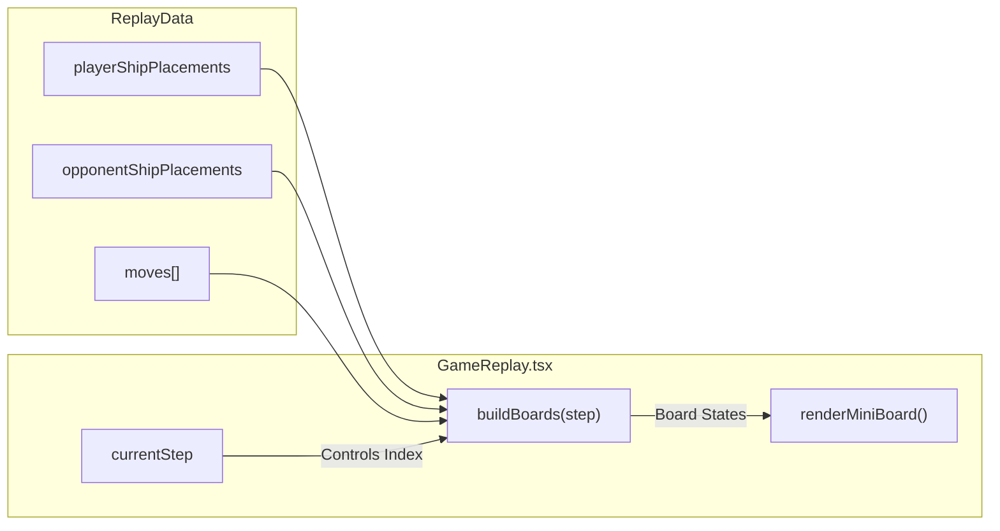

# Game Over & Replay Viewer

<details>
<summary>Relevant source files</summary>

The following files were used as context for generating this wiki page:

- [src/components/GameOver.tsx](https://github.com/kllyjsn/battleship/blob/main/src/components/GameOver.tsx)
- [src/components/GameReplay.tsx](https://github.com/kllyjsn/battleship/blob/main/src/components/GameReplay.tsx)
- [src/lib/replay.ts](https://github.com/kllyjsn/battleship/blob/main/src/lib/replay.ts)

</details>


The post-game experience in Battleship is managed by two primary components: `GameOver.tsx`, which handles the transition from active gameplay to results and leaderboard submission, and `GameReplay.tsx`, which provides a step-by-step reconstruction of the match using serialized game data.

## Game Over Lifecycle

When a game concludes, the application displays a modal overlay that summarizes the result, calculates performance metrics, and allows the player to persist their score to the global or local leaderboard.

### Victory and Defeat Logic
The `GameOver` component `src/components/GameOver.tsx:41-161` uses the `winner` prop to determine the visual theme of the overlay. A victory triggers a green "Trophy" icon and "VICTORY" text `src/components/GameOver.tsx:75-88`, while a defeat displays a red "Skull" icon `src/components/GameOver.tsx:78-88`.

### Callsign Entry & Leaderboard Pipeline
For winning players, a "Callsign" entry form is presented `src/components/GameOver.tsx:97-125`.
1.  **Persistence**: The player's name is persisted in `localStorage` under the key `battleship-session-name` `src/components/GameOver.tsx:23-39` to streamline future entries.
2.  **Submission**: Upon clicking "SAVE SCORE", the `handleSaveScore` function `src/components/GameOver.tsx:47-62` invokes `addLeaderboardEntry` `src/lib/leaderboard.ts`.
3.  **Data Payload**: The entry includes `shots`, `hits`, `durationSeconds`, and `difficulty` `src/components/GameOver.tsx:51-57`.

### Action Triggers
The overlay provides three primary navigation paths:
*   **Deploy Again**: Restarts the game loop via `onPlayAgain` `src/components/GameOver.tsx:132-139`.
*   **Watch Replay**: Opens the replay viewer via `onWatchReplay` `src/components/GameOver.tsx:140-149`.
*   **Base**: Returns the user to the main menu via `onGoHome` `src/components/GameOver.tsx:150-157`.

**GameOver Component Data Flow**
```mermaid
graph TD
    "GamePhase:OVER" --> "GameOver.tsx"
    "GameOver.tsx" -- "loadSessionName()" --> "localStorage"
    "GameOver.tsx" -- "handleSaveScore()" --> "addLeaderboardEntry()"
    "addLeaderboardEntry()" -- "API POST" --> "Vercel Serverless"
    "GameOver.tsx" -- "onWatchReplay()" --> "GameReplay.tsx"
    "GameOver.tsx" -- "onPlayAgain()" --> "GameMode Reset"
```
**Sources:** `src/components/GameOver.tsx:1-161`, `src/lib/leaderboard.ts`

---

## Game Replay System

The replay system allows users to review every move of a completed match. It operates by reconstructing the game state from a serialized `ReplayData` object.

### Data Contracts
Replays are defined by two main interfaces in `src/lib/replay.ts`:
*   **`ReplayMove`**: Records the actor (`player` or `opponent`), coordinates, and the `result` (hit, miss, or sunk). It includes `shipPositions` for 'sunk' results to allow the UI to reveal the full ship `src/lib/replay.ts:3-11`.
*   **`ReplayData`**: Contains the initial `playerShipPlacements`, `opponentShipPlacements`, the array of `moves`, and metadata like `difficulty` and `date` `src/lib/replay.ts:13-20`.

### State Reconstruction
The `GameReplay` component `src/components/GameReplay.tsx:42-148` does not store 50 different board states. Instead, it uses a memoized `buildBoards` function `src/components/GameReplay.tsx:51-88` that:
1.  Starts with empty boards `src/components/GameReplay.tsx:12-22`.
2.  Places initial ships `src/components/GameReplay.tsx:24-36`.
3.  Iterates through the `moves` array up to the `currentStep`, applying each attack's result to the respective board `src/components/GameReplay.tsx:55-85`.

### Playback Controller
The viewer includes a playback engine managed by `useEffect` and a `timerRef` `src/components/GameReplay.tsx:93-104`.
*   **Speed Multiplier**: A `speed` state `src/components/GameReplay.tsx:45` adjusts the `setTimeout` delay using the formula `1000 / speed` `src/components/GameReplay.tsx:97`.
*   **Auto-Stop**: Playback automatically pauses when `currentStep` reaches `totalMoves` `src/components/GameReplay.tsx:98-99`.

### Mini-Board Rendering
The `renderMiniBoard` function `src/components/GameReplay.tsx:111-146` creates a high-density 10x10 grid. It applies specific background colors based on the `CellState`:
*   **Ship**: Faint green `src/components/GameReplay.tsx:126`.
*   **Hit**: Bright red `src/components/GameReplay.tsx:127`.
*   **Sunk**: Dark red `src/components/GameReplay.tsx:128`.
*   **Miss**: Slate grey `src/components/GameReplay.tsx:129`.

**Replay Reconstruction Logic**

**Sources:** `src/lib/replay.ts:1-21`, `src/components/GameReplay.tsx:1-148`

## Technical Reference Table

| Feature | Implementation Detail | Source |
| :--- | :--- | :--- |
| **Callsign Storage** | `localStorage` key `battleship-session-name` | `src/components/GameOver.tsx:23` |
| **Score Submission** | `addLeaderboardEntry` in `lib/leaderboard` | `src/components/GameOver.tsx:51` |
| **Coordinate Labeling** | `String.fromCharCode(65 + row)` (A-J) | `src/components/GameReplay.tsx:39` |
| **Replay Highlighting** | `boxShadow` and `border` on `highlightPos` | `src/components/GameReplay.tsx:137-138` |
| **Speed Control** | `1x`, `2x`, etc. via `speed` state | `src/components/GameReplay.tsx:45` |

**Sources:** `src/components/GameOver.tsx:1-161`, `src/components/GameReplay.tsx:1-148`, `src/lib/replay.ts:1-21`

---