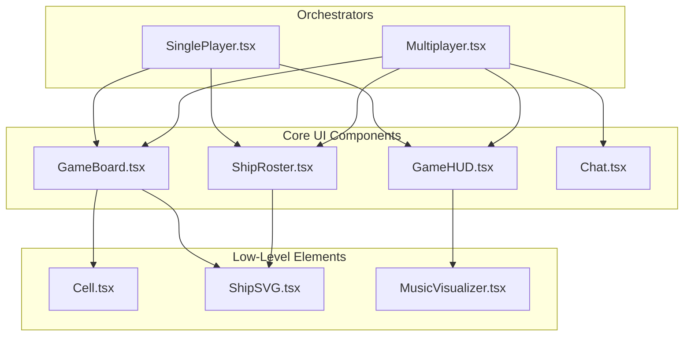
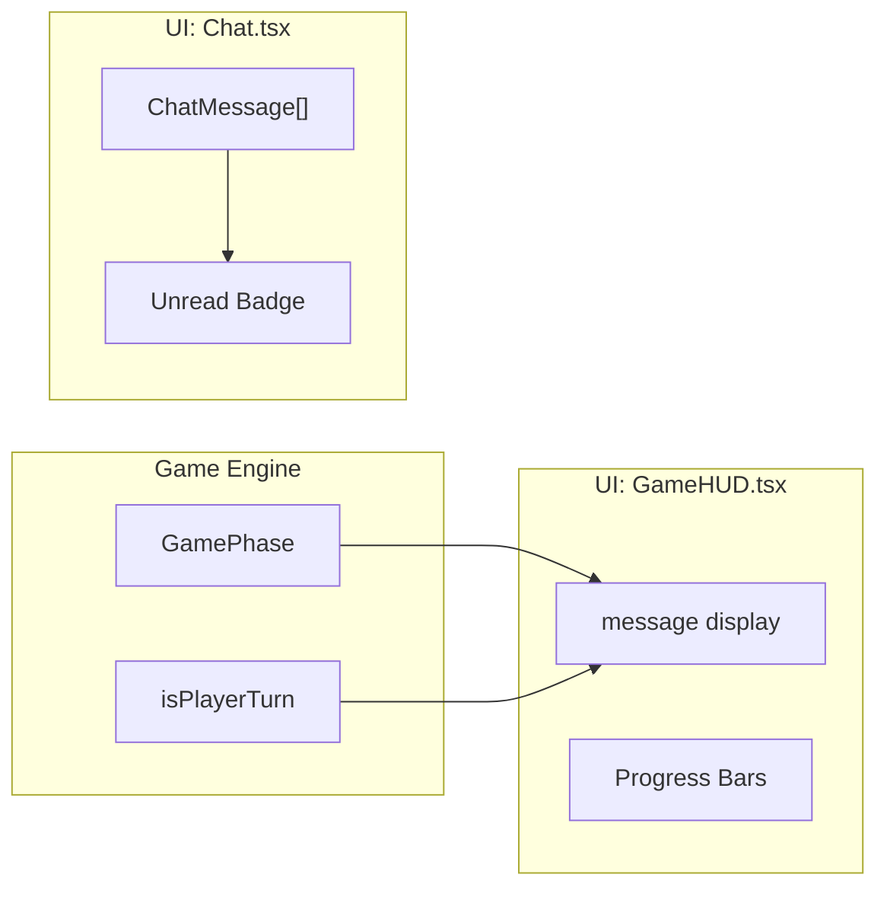

# UI Components

Relevant source files

The following files were used as context for generating this wiki page:

- [src/components/Cell.tsx](https://github.com/kllyjsn/battleship/blob/main/src/components/Cell.tsx)
- [src/components/Chat.tsx](https://github.com/kllyjsn/battleship/blob/main/src/components/Chat.tsx)
- [src/components/GameBoard.tsx](https://github.com/kllyjsn/battleship/blob/main/src/components/GameBoard.tsx)
- [src/components/GameHUD.tsx](https://github.com/kllyjsn/battleship/blob/main/src/components/GameHUD.tsx)
- [src/components/ShipRoster.tsx](https://github.com/kllyjsn/battleship/blob/main/src/components/ShipRoster.tsx)
- [src/engine/ai.ts](https://github.com/kllyjsn/battleship/blob/main/src/engine/ai.ts)

The Battleship UI is a component-based library built with React and Tailwind CSS, designed to provide a high-fidelity naval combat experience. It features a custom themeable design system, real-time feedback through animations and sound, and a responsive layout that supports both desktop and mobile play.

### Component Architecture

The UI is structured into several functional areas, ranging from the core game grid to the command-and-control overlays.

#### Core Grid & Visuals
*   **Board & Cell**: The primary interaction surface. `GameBoard.tsx` manages the 10x10 grid layout `src/components/GameBoard.tsx:1-40`, while `Cell.tsx` handles individual state rendering (hit/miss/sunk) and particle animations `src/components/Cell.tsx:33-100`.
*   **Ship Management**: `ShipRoster.tsx` provides the interface for selecting, rotating, and placing ships during the setup phase, and monitoring fleet health during battle `src/components/ShipRoster.tsx:20-42`.

#### Information Displays (HUD & Logs)
*   **GameHUD**: The "Command Center" at the top of the screen. It displays turn status, progress bars for both fleets, and audio controls `src/components/GameHUD.tsx:19-40`.
*   **Comms (Chat)**: A real-time communication panel used in multiplayer mode, supporting text messages and emoji reactions `src/components/Chat.tsx:14-30`.

#### Menus & Overlays
*   **Main Menu**: The entry point for selecting game modes and accessing stats.
*   **Post-Game**: `GameOver.tsx` handles the transition from battle to results, including leaderboard submission and replay triggers.

---

### Component Relationships

The following diagram illustrates how the top-level game orchestrators (SinglePlayer/Multiplayer) utilize the UI component library.

**UI Component Hierarchy**

**Sources:** `src/components/GameBoard.tsx:1-10`, `src/components/GameHUD.tsx:1-5`, `src/components/ShipRoster.tsx:1-5`, `src/components/Chat.tsx:1-5`

---

### Board Rendering & Cell States

The `Cell` component is a state-driven element that maps the `CellState` engine type to visual styles and animations. It uses a `prevStateRef` to trigger transition animations when a cell changes from `empty` to a terminal state like `hit` or `miss` `src/components/Cell.tsx:60-68`.

| State | Visual Representation | Animation Trigger |
| :--- | :--- | :--- |
| `empty` | Thematic background (CRT/Sonar/etc) | N/A |
| `ship` | Solid hull color (player board only) | N/A |
| `hit` | Red glow + Orange particles | `explosionParticle` `src/components/Cell.tsx:114-129` |
| `miss` | Water ripple rings | `waterSplash` `src/components/Cell.tsx:132-144` |
| `sunk` | Red flash + Rising bubbles | `sinkingSequence` `src/components/Cell.tsx:147-165` |

For details, see [Board & Cell Rendering](#5.1).

---

### Ship Roster & Placement UI

`ShipRoster.tsx` serves two distinct purposes based on the `mode` prop:
1.  **Placement Mode**: Acts as a dock for unplaced ships. Supports drag-and-drop via `onDragStart` `src/components/ShipRoster.tsx:36-40` and manual selection for keyboard/click placement.
2.  **Battle Mode**: Transforms into a "Fleet Status" dashboard, showing individual ship health and hit markers `src/components/ShipRoster.tsx:43-98`.

For details, see [Ship Roster & Placement UI](#5.3).

---

### HUD & Communication

The `GameHUD` manages the high-level game state display. It uses a `glow-pulse` animation on the turn indicator to draw the player's attention when it is their move `src/components/GameHUD.tsx:55-70`. In Multiplayer, the `Chat` component provides a `COMMS` panel with unread message badges and auto-scroll functionality `src/components/Chat.tsx:43-57`.

**Data Flow: HUD & Comms**

**Sources:** `src/components/GameHUD.tsx:5-31`, `src/components/Chat.tsx:7-12`

For details, see [HUD, Chat & Battle Log](#5.2).

---

### Child Pages

*   [Board & Cell Rendering](#5.1) — Grid mechanics, animations, and drag-and-drop.
*   [HUD, Chat & Battle Log](#5.2) — Phase-based layouts and communication tools.
*   [Ship Roster & Placement UI](#5.3) — Fleet management and SVG iconography.
*   [Game Over & Replay Viewer](#5.4) — Post-game analysis and state reconstruction.
*   [Main Menu & Overlays](#5.5) — Navigation, settings, and achievement panels.

---