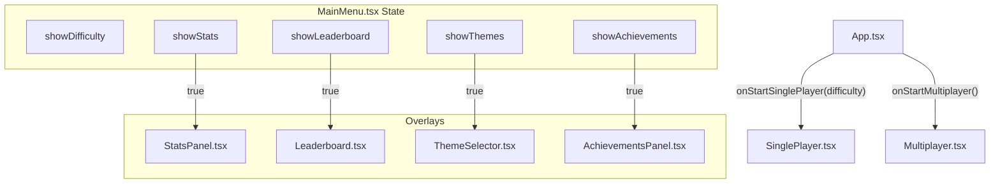
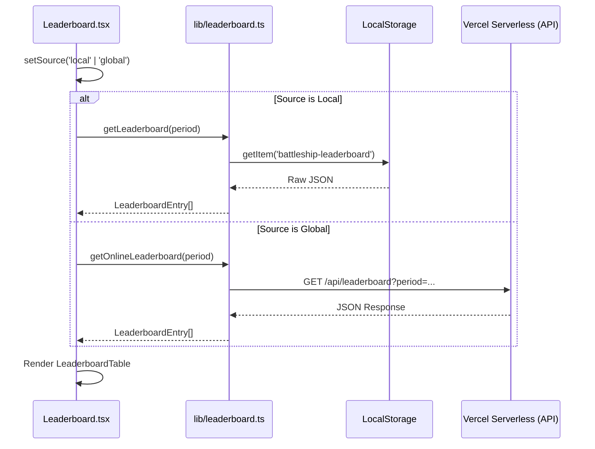

# Main Menu & Overlays

Relevant source files

The following files were used as context for generating this wiki page:

- [src/components/AchievementToast.tsx](https://github.com/kllyjsn/battleship/blob/main/src/components/AchievementToast.tsx)
- [src/components/AchievementsPanel.tsx](https://github.com/kllyjsn/battleship/blob/main/src/components/AchievementsPanel.tsx)
- [src/components/Leaderboard.tsx](https://github.com/kllyjsn/battleship/blob/main/src/components/Leaderboard.tsx)
- [src/components/MainMenu.tsx](https://github.com/kllyjsn/battleship/blob/main/src/components/MainMenu.tsx)
- [src/components/StatsPanel.tsx](https://github.com/kllyjsn/battleship/blob/main/src/components/StatsPanel.tsx)
- [src/components/ThemeSelector.tsx](https://github.com/kllyjsn/battleship/blob/main/src/components/ThemeSelector.tsx)
- [src/lib/gameResults.ts](https://github.com/kllyjsn/battleship/blob/main/src/lib/gameResults.ts)
- [src/lib/themes.ts](https://github.com/kllyjsn/battleship/blob/main/src/lib/themes.ts)

The Main Menu and its associated overlays serve as the "Naval Command Center" for the Battleship application. This system manages game mode transitions, difficulty selection, persistence visualization (stats and achievements), and global aesthetic configuration via the theme system.

### Main Menu Architecture

The `MainMenu` component acts as the central hub, managing the visibility of several modal overlays through React state `src/components/MainMenu.tsx:16-21`. It provides entry points for both Single Player (with difficulty selection) and Multiplayer modes.

#### Mode & Difficulty Selection
- **Single Player**: Transitions the user to a difficulty selection sub-menu `src/components/MainMenu.tsx:85-108`. Difficulties map to specific AI behaviors: Recruit (`easy`), Captain (`medium`), and Admiral (`hard`) `src/components/MainMenu.tsx:23-27`.
- **Multiplayer**: Directly invokes the `onStartMultiplayer` callback passed from the application root `src/components/MainMenu.tsx:71-81`.

#### Navigation Data Flow
The following diagram illustrates how the `MainMenu` orchestrates transitions between the primary menu view and various technical overlays.

**Main Menu Overlay Orchestration**

Sources: `src/components/MainMenu.tsx:10-21`, `src/components/MainMenu.tsx:54-132`

---

### Theme System & Selector

The `ThemeSelector` provides a visual interface for switching between CSS-variable-based themes defined in `themes.ts`.

#### Implementation Details
- **3x3 Preview Grid**: Each theme option renders a miniature 10x10-style grid representing `cell-empty`, `cell-hit`, `cell-ship`, `cell-miss`, and `cell-sunk` states to preview the palette `src/components/ThemeSelector.tsx:52-68`.
- **CSS Injection**: When a theme is selected, `applyTheme` iterates through the theme's `vars` object and calls `document.documentElement.style.setProperty` to update global CSS tokens `src/lib/themes.ts:121-127`.
- **Persistence**: Selections are persisted to `localStorage` via `saveTheme` `src/lib/themes.ts:113-119`.

| Theme ID | Name | Description | Key Variable Example |
| :--- | :--- | :--- | :--- |
| `classic` | Classic CRT | Retro terminal blue/green | `--text-primary: #39ff14` |
| `sonar` | Sonar | High-contrast dark green | `--board-bg: #040d04` |
| `satellite`| Satellite | Deep ocean blue | `--board-bg: #0c2340` |
| `arctic` | Arctic | Ice blue and white | `--text-primary: #1a5090` |

Sources: `src/lib/themes.ts:8-92`, `src/components/ThemeSelector.tsx:37-91`

---

### Stats & Analytics

The `StatsPanel` visualizes historical game data retrieved from `localStorage`. It utilizes the `recharts` library for graphical representation.

#### Key Functions
- **Data Aggregation**: Uses `getStatsOverview` to process raw `GameRecord` objects into win rates, accuracy percentages, and difficulty-based breakdowns `src/components/StatsPanel.tsx:11-17`.
- **Visualizations**: 
    - **Overview Cards**: Displays total games, win rate, W/L ratio, and accuracy `src/components/StatsPanel.tsx:48-69`.
    - **Bar Chart**: A `BarChart` component displays "Wins by Difficulty" using specific color tokens for easy, medium, and hard levels `src/components/StatsPanel.tsx:74-103`.

Sources: `src/components/StatsPanel.tsx:19-25`, `src/lib/gameResults.ts:13-24`

---

### Achievements & Notifications

The achievement system consists of a persistent gallery (`AchievementsPanel`) and a real-time notification system (`AchievementToast`).

#### AchievementsPanel
- **Categorization**: Achievements are grouped into `combat`, `skill`, `social`, and `milestone` `src/components/AchievementsPanel.tsx:10-17`.
- **Progress Tracking**: Calculates the ratio of unlocked achievements vs. total available and displays a themed progress bar `src/components/AchievementsPanel.tsx:25-68`.
- **State**: Unlocked items display their unique icon and "EARNED" status; locked items are grayscaled with a padlock icon `src/components/AchievementsPanel.tsx:83-112`.

#### AchievementToast
This component handles the queueing and display of newly unlocked medals.
- **Sequential Display**: If multiple achievements are unlocked simultaneously (e.g., at the end of a match), the toast cycles through them using `setTimeout` logic `src/components/AchievementToast.tsx:22-31`.
- **Animation**: Uses Tailwind transitions to slide in from the top of the screen `src/components/AchievementToast.tsx:42-44`.

Sources: `src/components/AchievementsPanel.tsx:19-35`, `src/components/AchievementToast.tsx:9-36`

---

### Leaderboard (Local & Global)

The `Leaderboard` component provides a dual-source view of high scores, allowing users to toggle between their local history and global rankings.

#### Data Fetching & Period Filtering
The component supports filtering by `day`, `week`, or `month` `src/components/Leaderboard.tsx:12-16`.
- **Local Source**: Synchronously retrieves data from `localStorage` via `getLeaderboard(period)` `src/components/Leaderboard.tsx:95`.
- **Global Source**: Asynchronously fetches data from the remote API via `getOnlineLeaderboard(period)` `src/components/Leaderboard.tsx:101-106`.

#### Leaderboard Logic Flow
The diagram below shows the interaction between the UI and the data fetching layer.

**Leaderboard Data Pipeline**

Sources: `src/components/Leaderboard.tsx:89-111`, `src/components/Leaderboard.tsx:31-87`

---