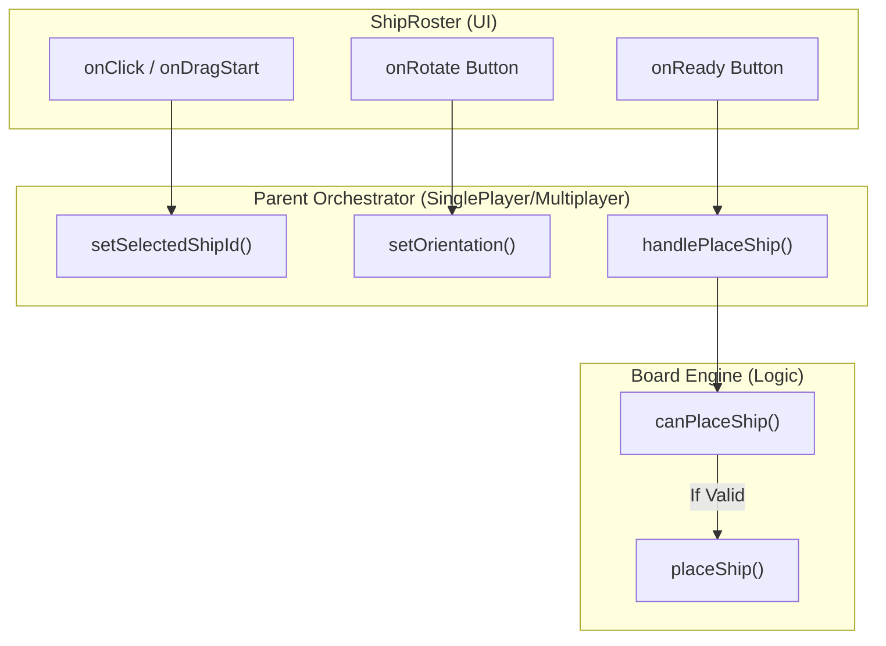
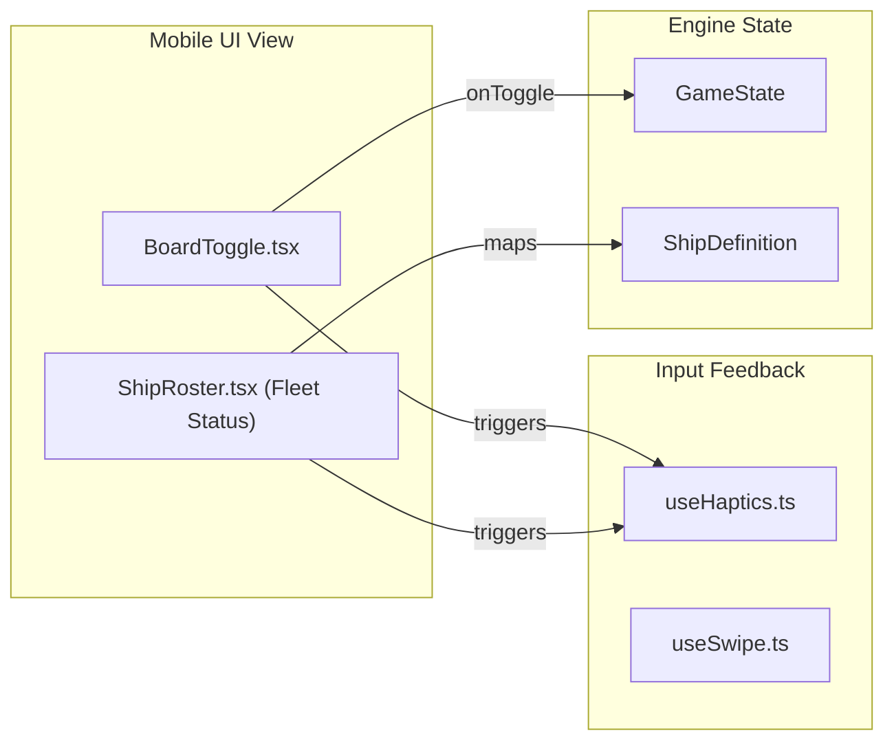

# Ship Roster & Placement UI

Relevant source files

The following files were used as context for generating this wiki page:

- [src/components/BoardToggle.tsx](https://github.com/kllyjsn/battleship/blob/main/src/components/BoardToggle.tsx)
- [src/components/ShipRoster.tsx](https://github.com/kllyjsn/battleship/blob/main/src/components/ShipRoster.tsx)
- [src/components/ShipSVG.tsx](https://github.com/kllyjsn/battleship/blob/main/src/components/ShipSVG.tsx)
- [src/engine/ai.ts](https://github.com/kllyjsn/battleship/blob/main/src/engine/ai.ts)
- [src/hooks/useHaptics.ts](https://github.com/kllyjsn/battleship/blob/main/src/hooks/useHaptics.ts)

The **Ship Roster** serves as the primary interface for fleet management. It operates in two distinct functional modes: **Placement Mode**, where players position their ships on the grid using drag-and-drop or click-to-place mechanics, and **Battle Mode**, where it transforms into a "Fleet Status" dashboard providing real-time telemetry on ship health and destruction status.

## ShipRoster Component

The `ShipRoster` component is a state-driven UI element that adapts based on the current `GamePhase` `src/components/ShipRoster.tsx:16`. It consumes ship definitions and placement data to render either an interactive staging area or a status monitor.

### Placement Mode Logic
In the placement phase, the roster allows players to select ships, toggle orientation, and commit their fleet layout.

*   **Selection & Drag-and-Drop**: Ships can be selected via click `src/components/ShipRoster.tsx:117` or dragged onto the `GameBoard`. The `handleDragStart` function initializes the `DataTransfer` object with the ship's unique ID `src/components/ShipRoster.tsx:36-40`.
*   **Orientation Control**: The `onRotate` callback toggles the `Orientation` state between `horizontal` and `vertical` `src/components/ShipRoster.tsx:158-166`. This state is used by the `GameBoard` to render placement previews.
*   **Fleet Randomization**: The `onRandomize` button triggers the board engine's random placement algorithm `src/components/ShipRoster.tsx:167-173`.
*   **Undo Mechanism**: Players can remove the last placed ship via `onUndoShip`, which is disabled once the player marks themselves as "Ready" `src/components/ShipRoster.tsx:175-189`.

### Battle Mode (Fleet Status)
Once the game transitions to the battle phase, the roster switches to a read-only dashboard `src/components/ShipRoster.tsx:42-98`.

*   **Hit Visualization**: Each ship entry displays a series of indicator pips corresponding to its `size`. These pips change color based on the ship's `hits` count:
    *   **Intact**: Low-opacity green `src/components/ShipRoster.tsx:88`.
    *   **Damaged**: Amber `src/components/ShipRoster.tsx:86-87`.
    *   **Sunk**: Solid red `src/components/ShipRoster.tsx:84-85`.
*   **Sunk State**: When a ship's `sunk` property is true, the UI applies a grayscale filter, reduces opacity, and adds a strikethrough to the ship's name `src/components/ShipRoster.tsx:68-75`.

### Ship Placement Data Flow
The following diagram illustrates how user interactions in the `ShipRoster` flow through the system to update the `Board` state.

**Placement Interaction Flow**

Sources: `src/components/ShipRoster.tsx:36-40`, `src/components/ShipRoster.tsx:117-123`, `src/components/ShipRoster.tsx:158-166`, `src/engine/board.ts:41-75`

## ShipSVG Component

The `ShipSVG` component provides detailed, vector-based iconography for the five ship types: Carrier, Battleship, Destroyer, Submarine, and Patrol Boat `src/components/ShipSVG.tsx:4-10`.

*   **Shared Definitions**: A `ShipDefs` sub-component defines SVG linear gradients used across all ships for consistent metallic textures (e.g., `hull`, `deck`, `superstructure`) `src/components/ShipSVG.tsx:12-50`.
*   **Memoization**: The component is wrapped in `memo` to prevent expensive re-renders of complex SVG paths during board interactions `src/components/ShipSVG.tsx:1`.
*   **Scaling**: Ship widths are dynamically calculated in the roster based on the ship's `size` property to maintain visual proportions `src/components/ShipRoster.tsx:66-67`.

Sources: `src/components/ShipSVG.tsx:1-10`, `src/components/ShipRoster.tsx:72`

## Mobile Board Switching

On small viewports, the application uses a `BoardToggle` component to switch between the player's own fleet and the target enemy grid.

### BoardToggle Component
The `BoardToggle` renders two primary action buttons:
1.  **YOUR FLEET**: Displays the player's board with a `Shield` icon `src/components/BoardToggle.tsx:11-21`.
2.  **ENEMY WATERS**: Displays the opponent's board with a `Crosshair` icon `src/components/BoardToggle.tsx:22-32`.

The component uses `lg:hidden` utility classes to remain invisible on desktop resolutions, ensuring the dual-grid layout is only collapsed on mobile `src/components/BoardToggle.tsx:10`.

### Haptic Feedback Integration
Interactions within the Roster and Board utilize the `useHaptics` hook to provide tactile confirmation on supported mobile devices `src/hooks/useHaptics.ts:16`.

*   **UI Interaction**: `light()` vibration (8ms) for general button presses `src/hooks/useHaptics.ts:29`.
*   **Combat Events**: `hit()` (40ms) and `sunk()` (triple pulse) patterns for battle updates `src/hooks/useHaptics.ts:20-23`.

**UI Entity Relationship Diagram**

Sources: `src/components/BoardToggle.tsx:8-35`, `src/hooks/useHaptics.ts:16-31`, `src/components/ShipRoster.tsx:49-52`

## Summary of Key Functions

| Function / Property | File | Purpose |
| :--- | :--- | :--- |
| `ShipRoster` | `ShipRoster.tsx` | Main container for ship selection and status. |
| `handleDragStart` | `ShipRoster.tsx` | Initiates HTML5 Drag-and-Drop for ship placement. |
| `ShipDefs` | `ShipSVG.tsx` | Defines reusable SVG gradients for ship textures. |
| `BoardToggle` | `BoardToggle.tsx` | Manages mobile visibility between player and enemy grids. |
| `vibrate` | `useHaptics.ts` | Wrapper for the `navigator.vibrate` API with fallbacks. |

Sources: `src/components/ShipRoster.tsx:20`, `src/components/ShipSVG.tsx:12`, `src/components/BoardToggle.tsx:8`, `src/hooks/useHaptics.ts:6`

---